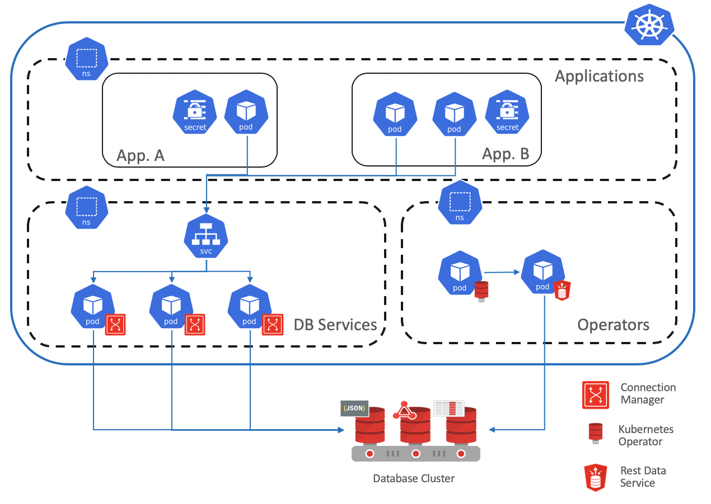

# Kubernetes with Oracle DB #

## Workshop Overview ##

This lab show you a seamless integration between an application deployed inside the kubernetes cluster and an oracle database.

Using the REST database interface to provisioning new database containers, a PDB, or even cloning existing one. Allows to use any Oracle Database with multitenant option in a DBaaS fashion in any environment (cloud, on-prem or hybrid)

The complexity of managing the connections to the database is abstracted by the usage of the Oracle Connection Manager so to have a "standard" kubernetes developer experience.

The operator creates a secret containing all the info for the connection, the visibility of which can be limited to the application itself so to achieve isolation of credentials.

A full architecture could be the one presented in this diagram:

## Workshop Requirements

- An OCI account with proper priviledge to access the object storage in OCI.
- OCIDs for tenancy, user and compartment

## Access the Labs Using Our Web Interface

**[Click here](https://minqiaowang.github.io/oci-k8s-cn/workshops/freetier)** to use our easy to navigate HTML format.

## Access the labs ##

- Use **Lab Contents** menu on your right to access the labs.
    - If the menu is not displayed, click the menu button  on the top right  make it visible.

- From the menu, click on the lab that you like to proceed with. 

- You may close the menu by clicking 

## Acknowledgements

- **Author** - Minqiao Wang, Database Product Management, PTS China - May 2020