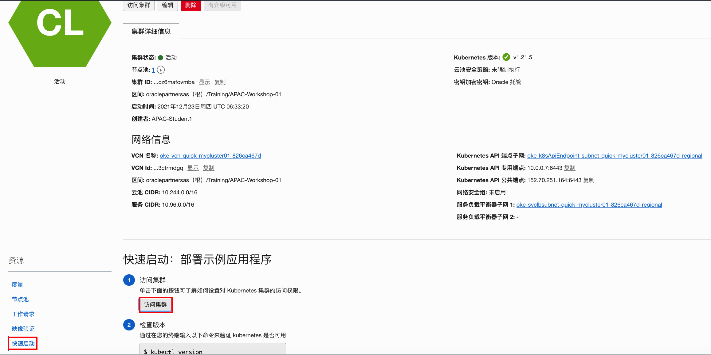
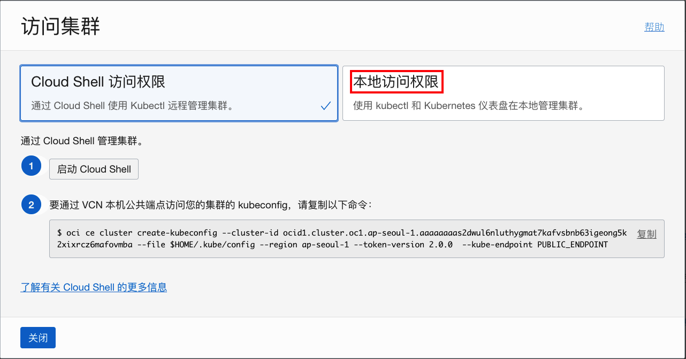
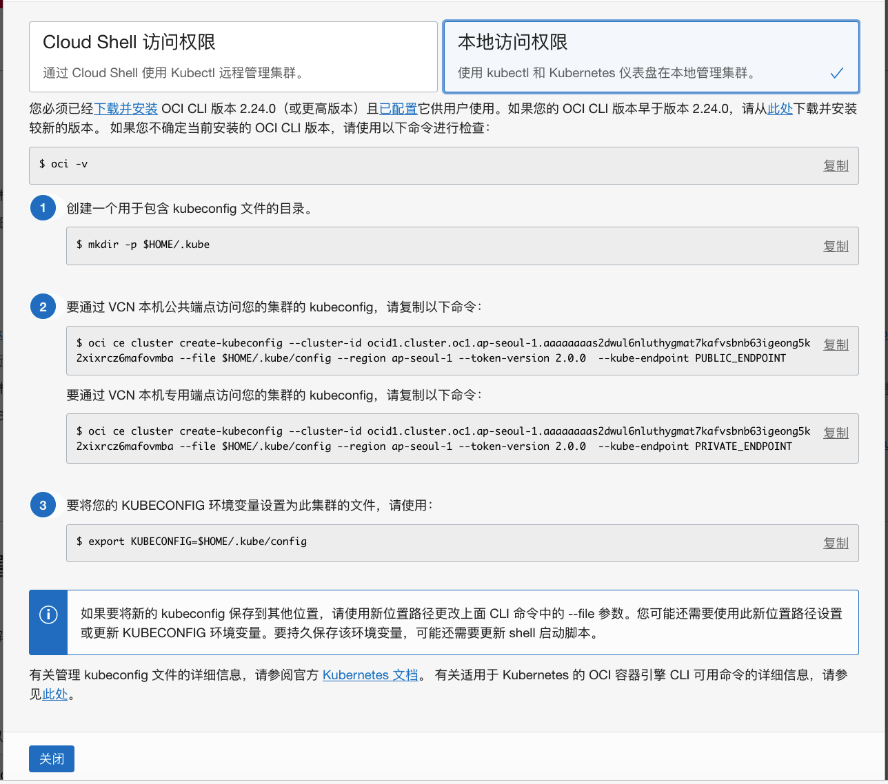
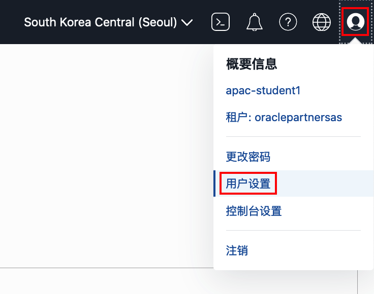
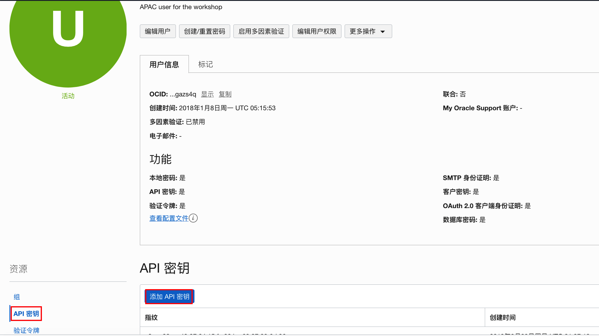
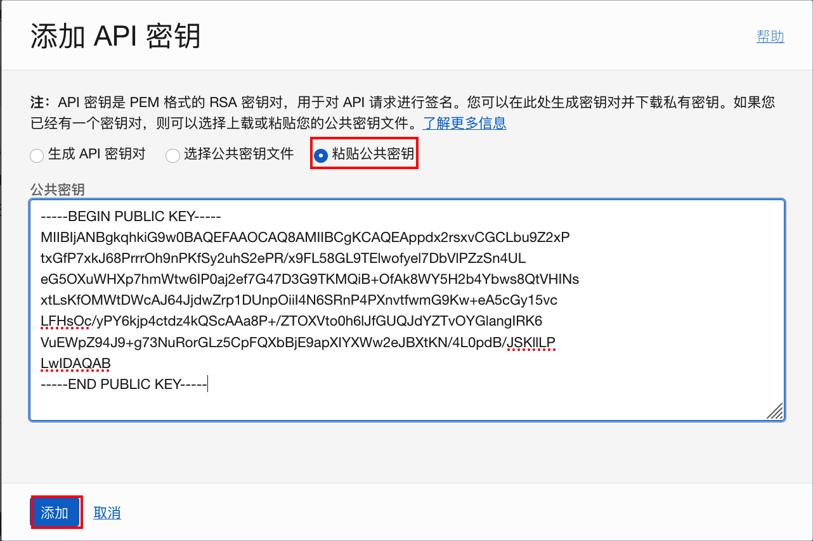
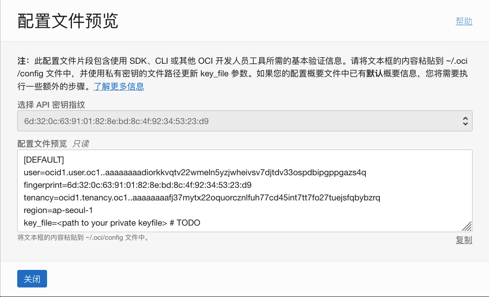

# 访问Kubernetes集群

## 简介

Kubernetes集群创建完成后，你可以通过Cloud Shell或本地机器访问Kubernetes集群。用Cloud Shell访问kubernetes集群相对简单，本练习会介绍如果用本地机器访问kubernetes集群。下面，我们会以Lab1中OCI上的虚拟机来模拟本地主机，配置kubernetes集群的访问。

### 先决条件
- 完成创建Kubernetes集群


## Task 1：了解kubernetes访问配置步骤

1. 在之前创建的kubernetes集群详细信息页面，在**资源**下选择**快速启动**，点击**访问集群**。

    

2. 这里提供两种访问集群的配置，点击**本地访问权限**。

    

3. 这里列出了本地访问配置步骤配置的命令。

    

    

## Task 2：安装和配置OCI CLI

1. 连接到虚拟主机，运行下面的命令来安装OCI CLI

```
$ <copy>sudo yum install -y python36-oci-cli</copy>
```


2. 运行 `oci setup config`命令来配置 OCI CLI. 需要事先查找租户和用户的OCID([参见文档](https://docs.oracle.com/en-us/iaas/Content/API/Concepts/apisigningkey.htm#five)). 

   - 接受缺省的config文件路径
   - 输入自己的用户OCID
   - 输入租户OCID
   - 选择对应的区域，如：ap-seoul-1
   - 需要创建RSA Key pair
   - 接受缺省的key名

   ```
   $ <copy>oci setup config</copy>
       This command provides a walkthrough of creating a valid CLI config file.
   
       The following links explain where to find the information required by this
       script:
   
       User API Signing Key, OCID and Tenancy OCID:
   
           https://docs.cloud.oracle.com/Content/API/Concepts/apisigningkey.htm#Other
   
       Region:
   
           https://docs.cloud.oracle.com/Content/General/Concepts/regions.htm
   
       General config documentation:
   
           https://docs.cloud.oracle.com/Content/API/Concepts/sdkconfig.htm
   
   
   Enter a location for your config [/home/opc/.oci/config]: 
   Enter a user OCID: ocid1.user.oc1..aaaaaaaadiorkkvqtv22wmeln5yzjwheivsv7djtdv33ospdbipgppgazs4q
   Enter a tenancy OCID: ocid1.tenancy.oc1..aaaaaaaafj37mytx22oquorcznlfuh77cd45int7tt7fo27tuejsfqbybzrq
   Enter a region by index or name(e.g.
   1: ap-chiyoda-1, 2: ap-chuncheon-1, 3: ap-hyderabad-1, 4: ap-ibaraki-1, 5: ap-melbourne-1,
   6: ap-mumbai-1, 7: ap-osaka-1, 8: ap-seoul-1, 9: ap-singapore-1, 10: ap-sydney-1,
   11: ap-tokyo-1, 12: ca-montreal-1, 13: ca-toronto-1, 14: eu-amsterdam-1, 15: eu-frankfurt-1,
   16: eu-marseille-1, 17: eu-milan-1, 18: eu-zurich-1, 19: il-jerusalem-1, 20: me-abudhabi-1,
   21: me-dubai-1, 22: me-jeddah-1, 23: sa-santiago-1, 24: sa-saopaulo-1, 25: sa-vinhedo-1,
   26: uk-cardiff-1, 27: uk-gov-cardiff-1, 28: uk-gov-london-1, 29: uk-london-1, 30: us-ashburn-1,
   31: us-gov-ashburn-1, 32: us-gov-chicago-1, 33: us-gov-phoenix-1, 34: us-langley-1, 35: us-luke-1,
   36: us-phoenix-1, 37: us-sanjose-1): ap-seoul-1
   Do you want to generate a new API Signing RSA key pair? (If you decline you will be asked to supply the path to an existing key.) [Y/n]: Y
   Enter a directory for your keys to be created [/home/opc/.oci]: 
   Enter a name for your key [oci_api_key]: 
   Public key written to: /home/opc/.oci/oci_api_key_public.pem
   Enter a passphrase for your private key (empty for no passphrase): 
   Private key written to: /home/opc/.oci/oci_api_key.pem
   Fingerprint: 6d:32:0c:63:91:01:82:8e:bd:8c:4f:92:34:53:23:d9
   Config written to /home/opc/.oci/config
   
   
       If you haven't already uploaded your API Signing public key through the
       console, follow the instructions on the page linked below in the section
       'How to upload the public key':
   
           https://docs.cloud.oracle.com/Content/API/Concepts/apisigningkey.htm#How2
   
   ```

3. 查看公钥内容，拷贝全部公钥内容到下一步使用。（**注意：**如果是使用的共享用户apac-student，请忽略第3到第7步）

   ```
   $ <copy>cat .oci/oci_api_key_public.pem</copy> 
   -----BEGIN PUBLIC KEY-----
   MIIBIjANBgkqhkiG9w0BAQEFAAOCAQ8AMIIBCgKCAQEAppdx2rsxvCGCLbu9Z2xP
   txGfP7xkJ68PrrrOh9nPKfSy2uhS2ePR/x9FL58GL9TElwofyel7DbVlPZzSn4UL
   eG5OXuWHXp7hmWtw6IP0aj2ef7G47D3G9TKMQiB+OfAk8WY5H2b4Ybws8QtVHINs
   xtLsKfOMWtDWcAJ64JjdwZrp1DUnpOiiI4N6SRnP4PXnvtfwmG9Kw+eA5cGy15vc
   LFHsOc/yPY6kjp4ctdz4kQScAAa8P+/ZTOXVto0h6lJfGUQJdYZTvOYGlangIRK6
   VuEWpZ94J9+g73NuRorGLz5CpFQXbBjE9apXIYXWw2eJBXtKN/4L0pdB/JSKllLP
   LwIDAQAB
   -----END PUBLIC KEY-----
   ```

4. 在OCI控制台页面，点击左上角**概要信息**然后点击**用户设置**。

   

5. 在**资源**下选择**API密钥**，然后点击**添加API密钥**。

   

6. 选择**粘贴公共密钥**，然后粘贴前面拷贝公共密钥的内容。点击**添加**。

   

7. 查看配置文件预览，点击**关闭**。每个用户能创建的API密钥数量有限制，如果你是用的共享用户，如：apac-student1，则跳到下一步，用共享的API密钥。

   

8. （共享用户的步骤）：下载共享的密钥对。

   ```
   $ <copy>wget https://objectstorage.ap-seoul-1.oraclecloud.com/p/fwn_EcTle9oKximyb0GMsC98WFebonvdhI1GKwl2Rv3h8hwk7BDtRHJM_rL7wOxk/n/oraclepartnersas/b/ADWLab/o/oci_api_key.zip</copy>
   ```

   

9. （共享用户的步骤）：解压到相应目录下，覆盖原有key文件。

   ```
   $ <copy>unzip oci_api_key.zip -d /home/opc/.oci/.</copy>
   Archive:  oci_api_key.zip
   replace /home/opc/.oci/./oci_api_key_public.pem? [y]es, [n]o, [A]ll, [N]one, [r]ename: A
     inflating: /home/opc/.oci/./oci_api_key_public.pem  
     inflating: /home/opc/.oci/./oci_api_key.pem 
   ```

   

10. （共享用户的步骤）：修改文件权限。

   ```
   $ <copy>chmod 600 /home/opc/.oci/oci_api_key.pem</copy>
   ```

   

11. （共享用户的步骤）：编辑oci config文件，`vi ./oci/config`，将fineprint修改成如下的值：

   ```
   fingerprint=6d:32:0c:63:91:01:82:8e:bd:8c:4f:92:34:53:23:d9
   ```
   
   
   
12. 在虚拟机的终端界面，测试OCI CLI命令，如果有正确返回，则配置成功。

   ```
   $ <copy>oci os ns get</copy>
   {
     "data": "oraclepartnersas"
   }
   ```


## Task 3：安装配置kubectl

kuberctl是kubernetes集群管理的命令行工具。

1. 下载kubectl最新版本:

   ```
   $ <copy>curl -LO "https://dl.k8s.io/release/$(curl -L -s https://dl.k8s.io/release/stable.txt)/bin/linux/amd64/kubectl"</copy>
     % Total    % Received % Xferd  Average Speed   Time    Time     Time  Current
                                    Dload  Upload   Total   Spent    Left  Speed
   100   154  100   154    0     0    450      0 --:--:-- --:--:-- --:--:--   451
   100 44.4M  100 44.4M    0     0  30.0M      0  0:00:01  0:00:01 --:--:-- 82.3M
   
   ```

2. 安装kubectl

   ```
   $ <copy>sudo install -o root -g root -m 0755 kubectl /usr/local/bin/kubectl</copy>
   ```

   

3. 测试并确认kubectl版本:

   ```
   $ <copy>kubectl version --client</copy>
   Client Version: version.Info{Major:"1", Minor:"23", GitVersion:"v1.23.1", GitCommit:"86ec240af8cbd1b60bcc4c03c20da9b98005b92e", GitTreeState:"clean", BuildDate:"2021-12-16T11:41:01Z", GoVersion:"go1.17.5", Compiler:"gc", Platform:"linux/amd64"}
   ```

   

6. 回到在Task 1中查询到的本地访问权限的设置步骤。

   

7. 在虚拟机终端界面，按顺序执行上面3步命令，其中第2步选择通过公共端点访问集群的命令。

   ```
   $ mkdir -p $HOME/.kube
   $ oci ce cluster create-kubeconfig --cluster-id ocid1.cluster.oc1.ap-seoul-1.aaaaaaaas2dwul...gmat7k...z6mafovmba --file $HOME/.kube/config --region ap-seoul-1 --token-version 2.0.0  --kube-endpoint PUBLIC_ENDPOINT
   New config written to the Kubeconfig file /home/opc/.kube/config
   $ export KUBECONFIG=$HOME/.kube/config
   ```
   
   
   
9. 这样kubectl安装配置完毕，你可以用命令访问kubernetes集群。先检查集群健康状态。

   ```
   $ <copy>kubectl get cs</copy>  
   Warning: v1 ComponentStatus is deprecated in v1.19+
   NAME                 STATUS    MESSAGE             ERROR
   controller-manager   Healthy   ok                  
   scheduler            Healthy   ok                  
   etcd-0               Healthy   {"health":"true"} 
   ```
   
   
   
9. 先检查集群节点状态。

   ```
   $ <copy>kubectl get nodes</copy>
   NAME          STATUS   ROLES   AGE     VERSION
   10.0.10.185   Ready    node    3h17m   v1.21.5
   10.0.10.21    Ready    node    3h18m   v1.21.5
   10.0.10.23    Ready    node    3h17m   v1.21.5
   ```

你的kubernetes集群可以正常访问。

   