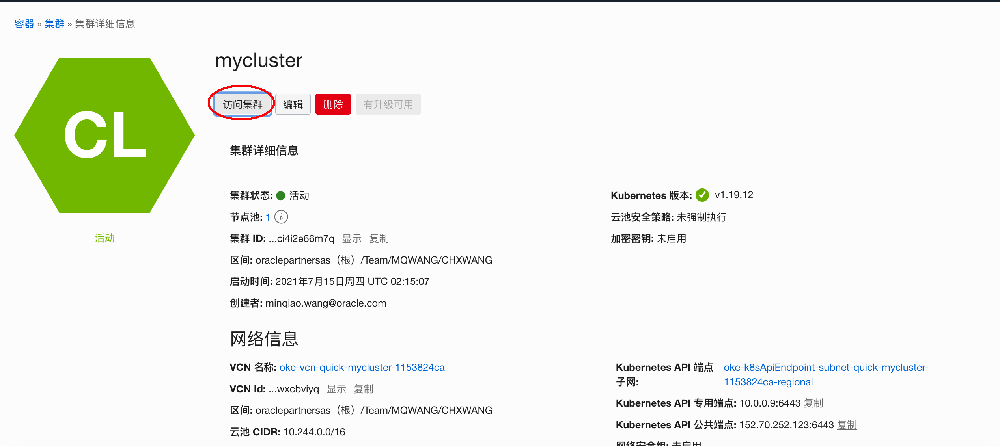

# 访问Kubernetes集群

### 简介

在本实验中，你将学会如何通过Cloud Shell或本地机器访问Kubernetes集群。

##通过 Cloud Shell访问集群

1. 在**集群详细信息**页面，点击**访问集群**。

   

   

2. 在弹出窗口，点击**复制**，复制访问集群的命令。然后**关闭**窗口。

   

   

3. 点击页面右上角**Cloud Shell**图标。

   

   

4. 页面下部会出现Cloud Shell终端。

   

   

5. 粘贴步骤 2 中的命令并执行它。 如：

   ```
   oci ce cluster create-kubeconfig --cluster-id ocid1.cluster.oc1.ap-tokyo-1.aaaaa***gbqt --file $HOME/.kube/config --region ap-tokyo-1 --token-version 2.0.0 
   ```

   

6. 现在你就可以在Cloud Shell中用kubectl命令来管理kubernetes集群。试试下面的命令：

   ```
   $ kubectl version
   Client Version: version.Info{Major:"1", Minor:"14", GitVersion:"v1.14.10", GitCommit:"575467a0eaf3ca1f20eb86215b3bde40a5ae617a", GitTreeState:"clean", BuildDate:"2019-12-11T12:41:00Z", GoVersion:"go1.12.12", Compiler:"gc", Platform:"linux/amd64"}
   Server Version: version.Info{Major:"1", Minor:"15", GitVersion:"v1.15.7", GitCommit:"4f504dd9ee54a3621502518bc64f0df487587d12", GitTreeState:"clean", BuildDate:"2020-01-23T00:34:28Z", GoVersion:"go1.12.7 BoringCrypto", Compiler:"gc", Platform:"linux/amd64"}
   $ kubectl get nodes
   NAME        STATUS   ROLES   AGE   VERSION
   10.0.10.2   Ready    node    49m   v1.15.7
   10.0.10.3   Ready    node    49m   v1.15.7
   10.0.10.4   Ready    node    49m   v1.15.7
   $ 
   ```


##从本地主机访问Kubernetes集群

下面，我们会用一台OCI上的虚拟机来模拟本地主机。创建虚拟机的步骤已省略，你需要获取虚机的公网IP。

### 步骤1. 部署虚拟机

1. 部署并获取虚拟机的公网IP。

   

   


### 步骤2. 安装和配置OCI CLI

1. 用SSH连接到虚拟主机(Windows上可以用putty)

   ```
   $ ssh -i labkey opc@xxx.xxx.xxx.xxx
   ```

2. 运行下面的命令来安装OCI CLI

   ```
   bash -c "$(curl -L https://raw.githubusercontent.com/oracle/oci-cli/master/scripts/install/install.sh)"
   ```

3. 接受缺省参数值

   ```
     Stored in directory: /tmp/tmp582hHd/wheels/f0/11/d1/8902b10e29e3ce2c8965a86533b76894c844565e02d5341520
     Building wheel for configparser (setup.py) ... done
     Created wheel for configparser: filename=configparser-3.5.0-py2-none-any.whl size=21661 sha256=62b501d9a4a5d17b2559eedf67e6a100ca8e5300e795839bad239bfcfec939df
     Stored in directory: /tmp/tmp582hHd/wheels/fe/e1/b2/ffea2d060a50955b9228e7a1dc7b1fc7a5013dc506da8c5272
   Successfully built PyYAML retrying terminaltables configparser
   Installing collected packages: six, pycparser, cffi, ipaddress, enum34, cryptography, certifi, PyYAML, python-dateutil, pyOpenSSL, pytz, configparser, oci, jmespath, retrying, idna, terminaltables, backports.functools-lru-cache, arrow, click, oci-cli
   Successfully installed PyYAML-5.1.2 arrow-0.14.7 backports.functools-lru-cache-1.6.1 certifi-2019.11.28 cffi-1.14.0 click-6.7 configparser-3.5.0 cryptography-2.8 enum34-1.1.10 idna-2.6 ipaddress-1.0.23 jmespath-0.9.4 oci-2.11.0 oci-cli-2.9.6 pyOpenSSL-18.0.0 pycparser-2.20 python-dateutil-2.8.1 pytz-2019.3 retrying-1.3.3 six-1.14.0 terminaltables-3.1.0
   
   ===> Modify profile to update your $PATH and enable shell/tab completion now? (Y/n): Y
   
   ===> Enter a path to an rc file to update (leave blank to use '/home/opc/.bashrc'): 
   -- Backed up '/home/opc/.bashrc' to '/home/opc/.bashrc.backup'
   -- Tab completion set up complete.
   -- If tab completion is not activated, verify that '/home/opc/.bashrc' is sourced by your shell.
   -- 
   -- ** Run `exec -l $SHELL` to restart your shell. **
   -- 
   -- Installation successful.
   -- Run the CLI with /home/opc/bin/oci --help
   [opc@oke-bastion ~]$ 
   ```

4. 运行 `exec -l $SHELL` 重启shell.

   ```
   [opc@oke-bastion ~]$ exec -l $SHELL
   [opc@oke-bastion ~]$
   ```

5. 运行 `oci setup config`命令来配置 OCI CLI. 接受默认目录。拷贝并粘贴租户和用户的OCID(参见 [文档](https://docs.cloud.oracle.com/en-us/iaas/Content/API/Concepts/apisigningkey.htm#Other)). 生成新的RSA键值对。

   ```
   [opc@oke-bastion ~]$ oci setup config
       This command provides a walkthrough of creating a valid CLI config file.
   
       The following links explain where to find the information required by this
       script:
   
       User OCID and Tenancy OCID:
   
           https://docs.cloud.oracle.com/Content/API/Concepts/apisigningkey.htm#Other
   
       Region:
   
           https://docs.cloud.oracle.com/Content/General/Concepts/regions.htm
   
       General config documentation:
   
           https://docs.cloud.oracle.com/Content/API/Concepts/sdkconfig.htm
   
   
   Enter a location for your config [/home/opc/.oci/config]: 
   Enter a user OCID: ocid1.user.oc1..aaaaaaaau4a24oyl3bj2ings4uzmuhcv7a27jhw6mdu3nqb2aoqs7e4pjmpa
   Enter a tenancy OCID: ocid1.tenancy.oc1..aaaaaaaafj37mytx22oquorcznlfuh77cd45int7tt7fo27tuejsfqbybzrq
   Enter a region (e.g. ap-melbourne-1, ap-mumbai-1, ap-osaka-1, ap-seoul-1, ap-sydney-1, ap-tokyo-1, ca-montreal-1, ca-toronto-1, eu-amsterdam-1, eu-frankfurt-1, eu-zurich-1, me-jeddah-1, sa-saopaulo-1, uk-gov-london-1, uk-london-1, us-ashburn-1, us-gov-ashburn-1, us-gov-chicago-1, us-gov-phoenix-1, us-langley-1, us-luke-1, us-phoenix-1): ap-tokyo-1
   Do you want to generate a new RSA key pair? (If you decline you will be asked to supply the path to an existing key.) [Y/n]: Y
   Enter a directory for your keys to be created [/home/opc/.oci]: 
   Enter a name for your key [oci_api_key]: 
   Public key written to: /home/opc/.oci/oci_api_key_public.pem
   Enter a passphrase for your private key (empty for no passphrase): 
   Private key written to: /home/opc/.oci/oci_api_key.pem
   Fingerprint: 87:26:7c:f8:0c:dd:6f:d5:e1:d4:c9:60:54:ec:96:9c
   Config written to /home/opc/.oci/config
   
   
       If you haven't already uploaded your public key through the console,
       follow the instructions on the page linked below in the section 'How to
       upload the public key':
   
           https://docs.cloud.oracle.com/Content/API/Concepts/apisigningkey.htm#How2
   
   
   [opc@oke-bastion ~]$ 
   ```

6. 查看公钥内容，拷贝到下一步使用。

   ```
   [opc@oke-bastion ~]$ cat .oci/oci_api_key_public.pem 
   -----BEGIN PUBLIC KEY-----
   MIIBIjANBgkqhkiG9w0BAQEFAAOCAQ8AMIIBCgKCAQEAs+vNX8kMsQmh5TSX73Ha
   jRfd7dJ7OnmSt125yVMI8X74E6QpGV7Ml6L3/drT8RpzsZM+hLtgFEFJlc2NWDyz
   9/PijQDGia4KyGR5/9+QBh4vjqSKuis44ppQKknRLEkn0BmKkQn8w5yaQ5WK9iav
   Kndllrm0L02HvNjlQ5McDZVzqVeGC2Wn+NKceT1K2z3ZSIhB6U99gtNh2gkHKHxe
   q/OedrlIMeuue415qDLeLSGSfxd+smpKpTf8rOC5vp+J8YPIGV0eP4enPL57DIEo
   +pS+QY4fcTMSeTs9ma87gXHtHYwP0Ygu/fFJcKg/gd9ctDXZfcYEygxosbORcz1J
   UwIDAQAB
   -----END PUBLIC KEY-----
   [opc@oke-bastion ~]$ 
   ```

7. 在OCI控制台页面，点击左上角**概要信息**然后点击**用户设置**。

   

8. 在**资源**下选择**API密钥**，然后点击**添加API密钥**。

   

9. 选择**粘贴公共密钥**，然后粘贴前面拷贝公共密钥的内容。点击**添加**。

   

10. 回到虚拟机的终端界面，测试OCI CLI命令，如果有正确返回，则配置成功。

    ```
    [opc@oke-bastion .oci]$ oci os ns get
    {
      "data": "oraclepartnersas"
    }
    [opc@oke-bastion .oci]$ 
    ```


### 步骤3. 安装配置kubectl 

1. 下载kubectl最新版本:

   ```
   [opc@oke-bastion ~]$ curl -LO https://storage.googleapis.com/kubernetes-release/release/`curl -s https://storage.googleapis.com/kubernetes-release/release/stable.txt`/bin/linux/amd64/kubectl
     % Total    % Received % Xferd  Average Speed   Time    Time     Time  Current
                                    Dload  Upload   Total   Spent    Left  Speed
   100 41.4M  100 41.4M    0     0  46.3M      0 --:--:-- --:--:-- --:--:-- 46.2M
   [opc@oke-bastion ~]$ 
   ```

2. 修改为可执行命名：

   ```
   $ chmod +x ./kubectl
   ```

3. 移动该命令到相应的路径：

   ```
   $ sudo mv ./kubectl /usr/local/bin/kubectl
   ```

4. 测试并确认这是最新版本:

   ```
   [opc@oke-bastion ~]$ kubectl version --client
   Client Version: version.Info{Major:"1", Minor:"21", GitVersion:"v1.21.3", GitCommit:"ca643a4d1f7bfe34773c74f79527be4afd95bf39", GitTreeState:"clean", BuildDate:"2021-07-15T21:04:39Z", GoVersion:"go1.16.6", Compiler:"gc", Platform:"linux/amd64"}
   [opc@oke-bastion ~]$
   ```

5. 在kubernetes集群页面，点击 **Access Cluster**.

   

   

6. 在弹出窗口，选择本地访问

   

7. 回到虚拟机终端界面，按顺序执行上面3条命令：

   ```
   [opc@oke-bastion ~]$ mkdir -p $HOME/.kube
   [opc@oke-bastion ~]$ oci ce cluster create-kubeconfig --cluster-id ocid1.cluster.oc1.ap-seoul-1.aaaaaaaauycbugsbln3y6e5tyk3vvym5qjvdx4bm3gnar5gfmcc5fljdfxra --file $HOME/.kube/config --region ap-seoul-1 --token-version 2.0.0  --kube-endpoint PUBLIC_ENDPOINT
   New config written to the Kubeconfig file /home/opc/.kube/config
   [opc@oke-bastion ~]$ export KUBECONFIG=$HOME/.kube/config
   [opc@oke-bastion ~]$
   ```

   

9. 这样kubectl安装配置完毕，你可以用命令访问kubernetes集群.

   ```
   [opc@oke-bastion ~]$ kubectl get nodes
   NAME          STATUS   ROLES   AGE   VERSION
   10.0.10.13    Ready    node    33m   v1.20.8
   10.0.10.131   Ready    node    35m   v1.20.8
   10.0.10.40    Ready    node    35m   v1.20.8
   [opc@oke-bastion ~]$ 
   ```


   