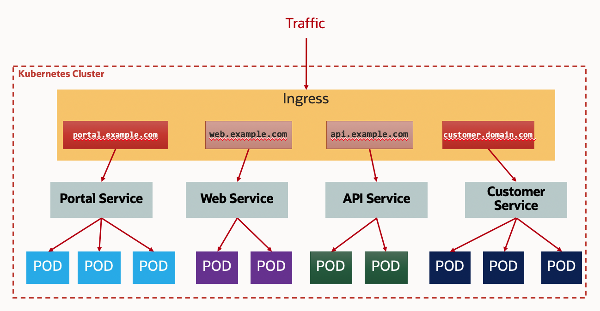

# 部署一个完整的应用

## 简介

test


### 先决条件

- 成功部署kubernetes集群
- 配置好访问集群

## Task 1: 创建OKE Ingress控制器

每个在kubernetes集群部署的服务，如果允许外部访问，缺省会创建一个Load Balancer。这样会浪费Load Balancer的资源。我们可以用Ingress来统一外部的访问。Ingress是一组规则，允许入站连接到达集群服务。 它位于多个服务的前面，充当智能路由器。



1. 运行下列命令在kubernetes集群里部署ingress控制器。

    ```
    $ <copy>kubectl apply -f https://raw.githubusercontent.com/kubernetes/ingress-nginx/controller-v0.44.0/deploy/static/provider/cloud/deploy.yaml</copy>
    namespace/ingress-nginx created
    serviceaccount/ingress-nginx created
    configmap/ingress-nginx-controller created
    clusterrole.rbac.authorization.k8s.io/ingress-nginx created
    clusterrolebinding.rbac.authorization.k8s.io/ingress-nginx created
    role.rbac.authorization.k8s.io/ingress-nginx created
    rolebinding.rbac.authorization.k8s.io/ingress-nginx created
    service/ingress-nginx-controller-admission created
    service/ingress-nginx-controller created
    deployment.apps/ingress-nginx-controller created
    validatingwebhookconfiguration.admissionregistration.k8s.io/ingress-nginx-admission created
    serviceaccount/ingress-nginx-admission created
    clusterrole.rbac.authorization.k8s.io/ingress-nginx-admission created
    clusterrolebinding.rbac.authorization.k8s.io/ingress-nginx-admission created
    role.rbac.authorization.k8s.io/ingress-nginx-admission created
    rolebinding.rbac.authorization.k8s.io/ingress-nginx-admission created
    job.batch/ingress-nginx-admission-create created
    job.batch/ingress-nginx-admission-patch created
    ```

    

2. 检查ingress控制器服务状态。记录下ingress控制器的External-IP。

    ```
    $ <copy>kubectl get svc -n ingress-nginx</copy>
    NAME                                 TYPE           CLUSTER-IP      EXTERNAL-IP      PORT(S)                      AGE
    ingress-nginx-controller             LoadBalancer   10.96.208.136   146.56.161.249   80:31276/TCP,443:31632/TCP   13m
    ingress-nginx-controller-admission   ClusterIP      10.96.10.134    <none>           443/TCP                      13m
    
    ```

    

3. 运行下列命令来创建自签名的证书和密钥。

    ```
    $ <copy>openssl req -x509 -nodes -days 365 -newkey rsa:2048 -keyout tls.key -out tls.crt -subj "/CN=nginxsvc/O=nginxsvc"</copy>
    Generating a 2048 bit RSA private key
    ...............+++
    ....................................................+++
    writing new private key to 'tls.key'
    -----
    ```

    

4. 用证书和密钥文件创建TLS secret。TLS secret是用于ingress控制器上的SSL终止的。

    ```
    $ <copy>kubectl create secret tls tls-secret --key tls.key --cert tls.crt</copy>
    secret/tls-secret created
    ```

    

5. sadf


## Task 2 ：安装部署工具Helm

Helm 是一个用于 Kubernetes 应用的包管理工具，主要用来管理Helm Charts。有点类似于Linux中的 YUM。Helm Chart 是用来封装 Kubernetes 原生应用程序的一系列 YAML 文件。可以在你部署应用的时候自定义应用程序的一些 Metadata，以便于应用程序的分发。对于应用发布者而言，可以通过 Helm 打包应用、管理应用依赖关系、管理应用版本并发布应用到软件仓库。对于使用者而言，使用 Helm 后不用需要编写复杂的应用部署文件，可以以简单的方式在 Kubernetes 上查找、安装、升级、回滚、卸载应用程序。

1. 下载helm安装包

    ```
    $ <copy>wget https://get.helm.sh/helm-v3.7.1-linux-386.tar.gz</copy>
    --2022-01-07 03:45:52--  https://get.helm.sh/helm-v3.7.1-linux-386.tar.gz
    Resolving get.helm.sh (get.helm.sh)... 152.199.39.108, 2606:2800:247:1cb7:261b:1f9c:2074:3c
    Connecting to get.helm.sh (get.helm.sh)|152.199.39.108|:443... connected.
    HTTP request sent, awaiting response... 200 OK
    Length: 12750265 (12M) [application/x-tar]
    Saving to: 'helm-v3.7.1-linux-386.tar.gz'
    
    100%[===================================================================>] 12,750,265  28.5MB/s   in 0.4s   
    
    2022-01-07 03:45:53 (28.5 MB/s) - 'helm-v3.7.1-linux-386.tar.gz' saved [12750265/12750265]
    
    ```

    

2. 解压。

    ```
    $ <copy>tar -zxvf helm-v3.7.1-linux-386.tar.gz</copy>
    linux-386/
    linux-386/helm
    linux-386/LICENSE
    linux-386/README.md
    ```

    

3. 安装。

    ```
    $ <copy>sudo chmod +x linux-386/helm</copy> 
    $ <copy>sudo mv linux-386/helm /usr/local/bin/</copy>
    ```

    

4. 验证。

    ```
    $ <copy>helm version</copy>
    WARNING: Kubernetes configuration file is group-readable. This is insecure. Location: /home/opc/.kube/config
    WARNING: Kubernetes configuration file is world-readable. This is insecure. Location: /home/opc/.kube/config
    version.BuildInfo{Version:"v3.7.1", GitCommit:"1d11fcb5d3f3bf00dbe6fe31b8412839a96b3dc4", GitTreeState:"clean", GoVersion:"go1.16.9"}
    ```

    

5. asdf


## Task 3: 部署Redis集群

1. 添加helm资料库。Bitnami是一个常用的资料库，提供各种应用程序和解决方案堆栈安装包下载。

    ```
    $ <copy>helm repo add bitnami https://charts.bitnami.com/bitnami</copy>
    WARNING: Kubernetes configuration file is group-readable. This is insecure. Location: /home/opc/.kube/config
    WARNING: Kubernetes configuration file is world-readable. This is insecure. Location: /home/opc/.kube/config
    "bitnami" has been added to your repositories
    ```

    

2. 新建一个命名空间，名称为redis。

    ```
    $ <copy>kubectl create ns redis</copy>
    namespace/redis created
    ```

    

3. 部署Redis集群(**注意：**请不要更改密码,发布程序打包时固定了)。

    ```
    $ <copy>helm install redis bitnami/redis -n redis --set auth.password=I3gQqFlxxU</copy>
    WARNING: Kubernetes configuration file is group-readable. This is insecure. Location: /home/opc/.kube/config
    WARNING: Kubernetes configuration file is world-readable. This is insecure. Location: /home/opc/.kube/config
    NAME: redis
    LAST DEPLOYED: Fri Jan  7 04:05:54 2022
    NAMESPACE: redis
    STATUS: deployed
    REVISION: 1
    TEST SUITE: None
    NOTES:
    CHART NAME: redis
    CHART VERSION: 15.7.1
    APP VERSION: 6.2.6
    
    ** Please be patient while the chart is being deployed **
    
    Redis&trade; can be accessed on the following DNS names from within your cluster:
    
        redis-master.redis.svc.cluster.local for read/write operations (port 6379)
        redis-replicas.redis.svc.cluster.local for read-only operations (port 6379)
    
    
    
    To get your password run:
    
        export REDIS_PASSWORD=$(kubectl get secret --namespace redis redis -o jsonpath="{.data.redis-password}" | base64 --decode)
    
    To connect to your Redis&trade; server:
    
    1. Run a Redis&trade; pod that you can use as a client:
    
       kubectl run --namespace redis redis-client --restart='Never'  --env REDIS_PASSWORD=$REDIS_PASSWORD  --image docker.io/bitnami/redis:6.2.6-debian-10-r90 --command -- sleep infinity
    
       Use the following command to attach to the pod:
    
       kubectl exec --tty -i redis-client \
       --namespace redis -- bash
    
    2. Connect using the Redis&trade; CLI:
       REDISCLI_AUTH="$REDIS_PASSWORD" redis-cli -h redis-master
       REDISCLI_AUTH="$REDIS_PASSWORD" redis-cli -h redis-replicas
    
    To connect to your database from outside the cluster execute the following commands:
    
        kubectl port-forward --namespace redis svc/redis-master 6379:6379 &
        REDISCLI_AUTH="$REDIS_PASSWORD" redis-cli -h 127.0.0.1 -p 6379
        
    ```

    

4. 检查pod状态，缺省会创建一主三从的Redis集群。如果状态还没准备好，可以稍等几分钟后再检查。直到全部Ready状态。

    ```
    $ <copy>kubectl get pod -n redis</copy>
    NAME               READY   STATUS              RESTARTS   AGE
    redis-master-0     1/1     Running             0          3m27s
    redis-replicas-0   1/1     Running             0          3m27s
    redis-replicas-1   1/1     Running             0          105s
    redis-replicas-2   0/1     ContainerCreating   0          15s
    $ kubectl get pod -n redis
    NAME               READY   STATUS    RESTARTS   AGE
    redis-master-0     1/1     Running   0          4m57s
    redis-replicas-0   1/1     Running   0          4m57s
    redis-replicas-1   1/1     Running   0          3m15s
    redis-replicas-2   1/1     Running   0          105s
    ```

    

5. 检查服务状态

    ```
    $ <copy>kubectl get svc -n redis</copy>
    NAME             TYPE        CLUSTER-IP      EXTERNAL-IP   PORT(S)    AGE
    redis-headless   ClusterIP   None            <none>        6379/TCP   8m22s
    redis-master     ClusterIP   10.96.200.226   <none>        6379/TCP   8m22s
    redis-replicas   ClusterIP   10.96.125.190   <none>        6379/TCP   8m22s
    ```

    

6. 你可以执行下面的命令来获取Redis密码。

    ```
    $ <copy>export REDIS_PASSWORD=$(kubectl get secret --namespace redis redis -o jsonpath="{.data.redis-password}" | base64 --decode)</copy>
    $ <copy>echo $REDIS_PASSWORD</copy>
    I3gQqFlxxU
    ```

    

7. 连接到redis master节点所在pod。

    ```
    $ <copy>kubectl -n redis exec -it redis-master-0 -- bash</copy>
    1001@redis-master-0:/$ 
    ```

    

8. 连接到redis，使用之前查询到的redis密码。

    ```
    1001@redis-master-0:/$ <copy>redis-cli -h redis-master -a 'I3gQqFlxxU'</copy>
    Warning: Using a password with '-a' or '-u' option on the command line interface may not be safe.
    redis-master:6379>
    ```

    

9. 在Redis中设置一个key-value，并查询出来。

    ```
    redis-master:6379> <copy>set myname testvalue</copy>
    OK
    redis-master:6379> <copy>get myname</copy>
    "testvalue"
    redis-master:6379>
    ```

    

10. 退出Redis，并退出相应pod。

    ```
    redis-master:6379> <copy>exit</copy>
    1001@redis-master-0:/$ <copy>exit</copy>
    exit
    $
    ```

    

11. asdf

## Task 4: 在kubernetes集群中部署MySQL

1. 编辑文件mysql-statusfull.yaml。复制以下内容到该文件，保存文件。

    ```
    <copy>
    ---
    apiVersion: v1
    kind: ConfigMap
    metadata:
      name: mysql
      labels:
        app: mysql
      namespace: redis
    data:
      master.cnf: |
        [mysqld]
        log-bin
    
    ---
    apiVersion: apps/v1
    kind: StatefulSet
    metadata:
      name: mysql
      namespace: redis
    spec:
      selector:
        matchLabels:
          app: mysql
      serviceName: mysql
      replicas: 1
      template:
        metadata:
          labels:
            app: mysql
        spec:
          containers:
          - name: mysql                   
            image: mysql
            env:
            - name: MYSQL_ROOT_PASSWORD
              value: "Ora@2021.passwd"
            ports:
            - name: mysql
              containerPort: 3306
            volumeMounts:
            - name: data
              mountPath: /var/lib/mysql
              subPath: mysql
            - name: conf
              mountPath: /etc/mysql/conf.d
            resources:
              requests:
                cpu: 500m
                memory: 1Gi
            volumeMounts:
            - name: data
              mountPath: /var/lib/mysql
              subPath: mysql
            - name: conf
              mountPath: /etc/mysql/conf.d
            resources:
              requests:
                cpu: 100m
                memory: 100Mi
          volumes:
          - name: conf
            emptyDir: {}
          - name: config-map
            configMap:
              name: mysql
      volumeClaimTemplates:
      - metadata:
          name: data
        spec:
          accessModes: ["ReadWriteOnce"]
          resources:
            requests:
              storage: 10Gi
    ---
    apiVersion: v1
    kind: Service
    metadata:
      name: mysql
      labels:
    app: mysql
      namespace: redis
    spec:
      ports:
      - name: mysql
        port: 3306
      clusterIP: None
      selector:
        app: mysql
    </copy>
    ```

    

2. sdaf

3. sdaf

4. sadf

5. asdf

6. sadf

7. sdaf

8. sdf

9. 