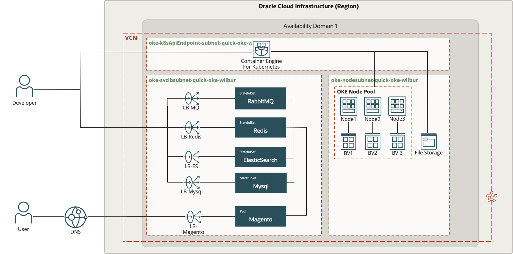
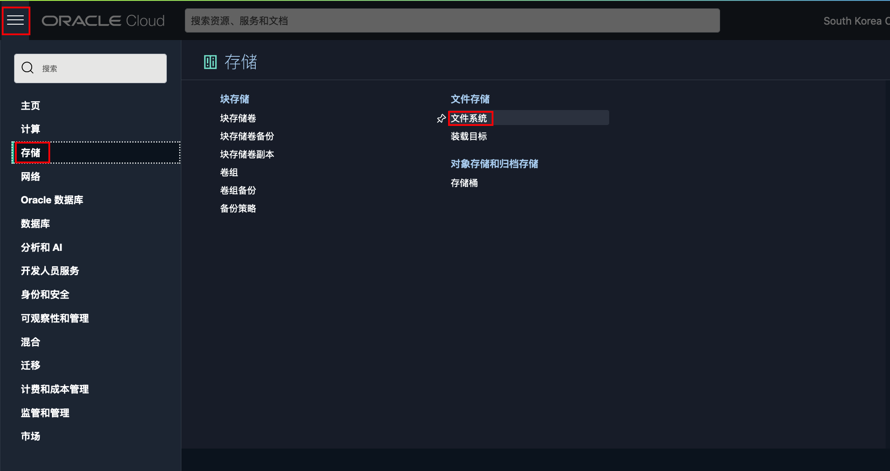
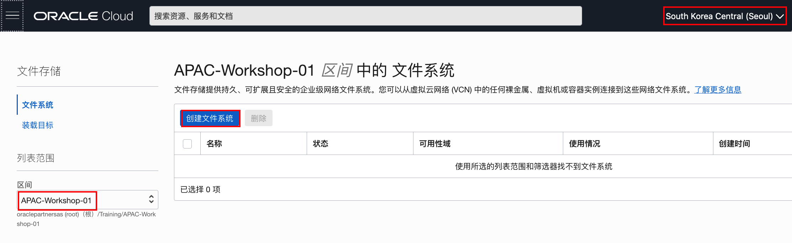
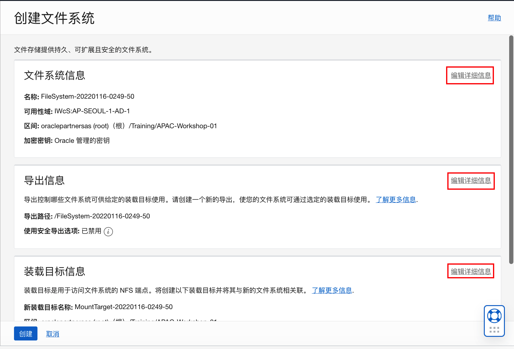
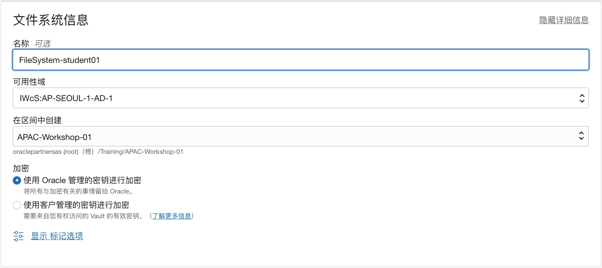
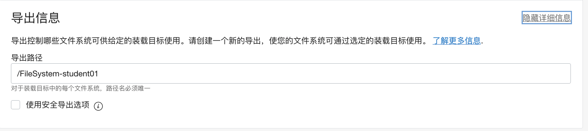
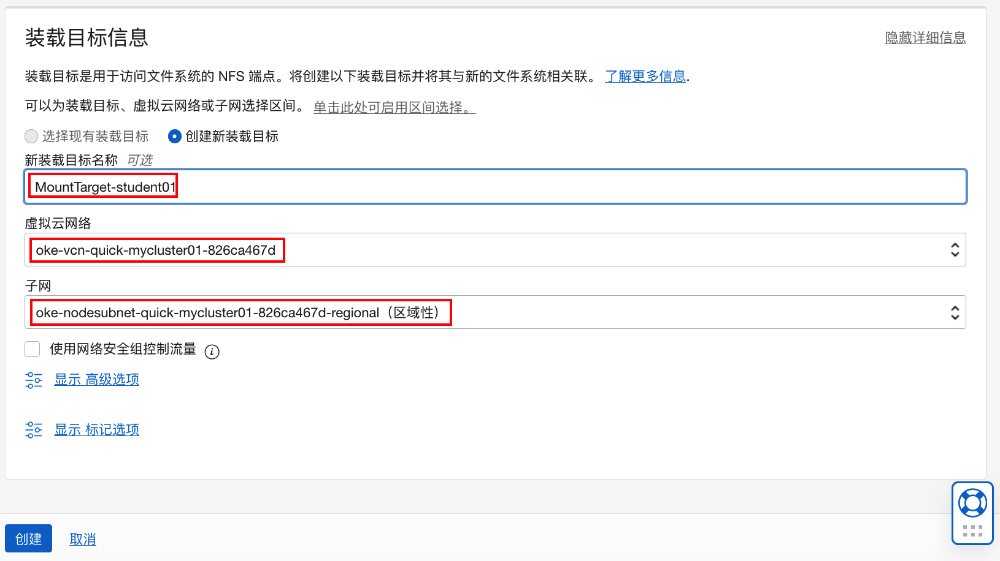
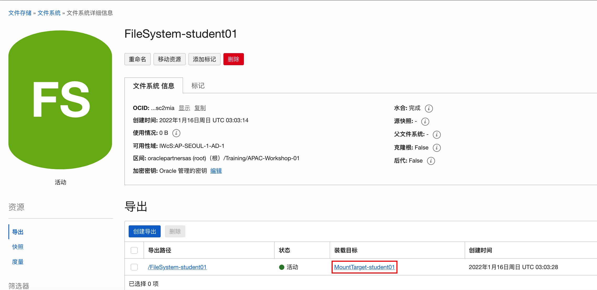
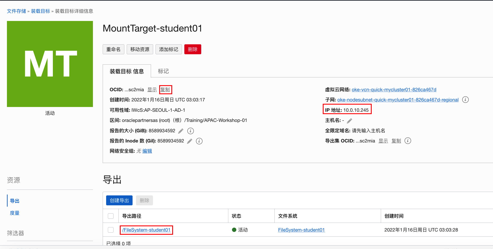

# 在OKE集群中搭建Magento电商网站

## 简介

Magento是一款新的专业开源电子商务平台，采用php进行开发，使用Zend Framework框架。Magento是跨境电商创建独立站时首选的开源平台之一。设计得非常灵活，具有模块化架构体系和功能，易于安装和部署。

下面，我们将示范如何在OKE中快速搭建一个Magento的电商网站。



### 先决条件

- 在OCI上安装配置Kubernetes集群
- 配置虚机能正常访问Kubernetes集群


## Task 1: 创建File Storage

1. 在OCI控制台主菜单，选择**存储**，点击**文件系统**。

    

2. 在确定正确的**区域**和**区间**后，点击**创建文件系统**。

    

3. 创建文件系统窗口可以设置三方面的信息，文件系统信息、导出信息以及装载目标信息。我们分别点击对应的**编辑详细信息**连接来进行设置。

    

4. 在文件系统详细信息里，我们可以修改文件系统的名称，如：FileSystem-student01。

    

5. 导出信息里的导出路径会自动修改成文件系统名称，你也可以修改。这里我们接受缺省导出路径名。

    

6. 在装载目标详细信息中，选择创建新装载目标，修改新装载目标名称，如：MountTarget-student01，选择kubernetes集群所在的VCN，子网选择work node所在的私有子网。点击**创建**。

    

7. 创建完成后，可以点击对应的装载目标连接。

    

8. 复制并保存该装载目标的OCID，IP地址，以及导出路径，后面的步骤会用到。

    

    


## Task 2: 下载Magento安装脚本

1. 连接到之前配置好的虚机，安装git工具。

    ```
    $ yum install -y git
    ```
    
    
    
1. 运行下列命令下载github上的Magento安装脚本。

    ```
    $ <copy>git clone -b hands-on-lab https://github.com/WilburOracle/magento-with-oci.git</copy>
    Cloning into 'magento-with-oci'...
    remote: Enumerating objects: 109, done.
    remote: Counting objects: 100% (109/109), done.
    remote: Compressing objects: 100% (85/85), done.
    remote: Total 109 (delta 38), reused 95 (delta 24), pack-reused 0
    Receiving objects: 100% (109/109), 7.55 MiB | 11.58 MiB/s, done.
    Resolving deltas: 100% (38/38), done.
    ```

    

2. 切换目录。

    ```
    $ <copy>cd magento-with-oci/k8s</copy>
    ```

    


## Task 3: 安装配置MySQL

1. 查看MySQL的配置文件，注意MySQL的服务名和root密码。

    ```
    $ <copy>cat mysql.yaml</copy> 
    #------------------------定义mysql服务-------------------------
    apiVersion: v1
    kind: Service
    metadata:
      name: mysql
      labels:
        k8s-app: mysql
    spec:
      ports:
       - port: 3306
         targetPort: 3306
         protocol: TCP
      selector:
        app: mysql
    ---
    #------------------------lb_mysql-------------------------
    apiVersion: v1
    kind: Service
    metadata:
      name: lb-mysql
    spec:
      type: LoadBalancer
      ports:
       - port: 3306
         targetPort: 3306
      selector:
        app: mysql
    ---
    
    # ------------------------定义mysql的部署 -----------------------
    
    apiVersion: apps/v1 # for versions before 1.9.0 use apps/v1beta2
    kind: StatefulSet
    metadata:
      name: mysql
    spec:
      replicas: 1
      serviceName: mysql
      selector:
        matchLabels:
          app: mysql
      revisionHistoryLimit: 2
      template:
        metadata:
          labels:
            app: mysql
        spec:
          dnsPolicy: ClusterFirst
          containers:
          # 应用的镜像
          - image: mysql
            name: mysql
            resources:
              limits:
                cpu: "1"
                memory: "1Gi"
              requests:
                cpu: "0.1"
                memory: "100Mi"
            imagePullPolicy: IfNotPresent
            env:
            - name: MYSQL_ROOT_PASSWORD
              value: "Oracle@123"
            # 应用的内部端口
            ports:
            - containerPort: 3306
              name: mysql3306
    ```

    

2. 在k8s中安装MySQL。

    ```
    $ <copy>kubectl apply -f mysql.yaml</copy>
    service/mysql created
    service/lb-mysql created
    statefulset.apps/mysql created
    ```

    

3. 查看MySQL的服务和Pod。可以看到pod名称为mysql-0，生成了名为mysql的服务，以及对应的LoadBalancer服务。

    ```
    $ <copy>kubectl get pod,svc</copy>
    NAME          READY   STATUS    RESTARTS   AGE
    pod/mysql-0   1/1     Running   0          109s
    
    NAME                 TYPE           CLUSTER-IP      EXTERNAL-IP     PORT(S)          AGE
    service/kubernetes   ClusterIP      10.96.0.1       <none>          443/TCP          23d
    service/lb-mysql     LoadBalancer   10.96.207.90    146.56.172.18   3306:32613/TCP   109s
    service/mysql        ClusterIP      10.96.170.207   <none>          3306/TCP         109s
    ```

    

4. 连接到MySQL所在pod。

    ```
    $ <copy>kubectl exec -it mysql-0 -- bash</copy>
    root@mysql-0:/# 
    ```

    

5. 在pod中连接MySQL数据库

    ```
    root@mysql-0:/# <copy>mysql -u root -pOracle@123</copy>
    mysql: [Warning] Using a password on the command line interface can be insecure.
    Welcome to the MySQL monitor.  Commands end with ; or \g.
    Your MySQL connection id is 9
    Server version: 8.0.27 MySQL Community Server - GPL
    
    Copyright (c) 2000, 2021, Oracle and/or its affiliates.
    
    Oracle is a registered trademark of Oracle Corporation and/or its
    affiliates. Other names may be trademarks of their respective
    owners.
    
    Type 'help;' or '\h' for help. Type '\c' to clear the current input statement.
    
    mysql> 
    ```

    

6. 运行下列命令创建数据库，创建用户并授权。

    ```
    mysql> <copy>CREATE DATABASE `bitnami_magento`CHARACTER SET utf8mb4;</copy>
    Query OK, 1 row affected (0.00 sec)
    
    mysql> <copy>create user 'cwb'@'%' identified WITH mysql_native_password by 'Oracle@123' PASSWORD EXPIRE NEVER;</copy>
    Query OK, 0 rows affected (0.01 sec)
    
    mysql> <copy>grant all privileges on *.* to 'cwb'@'%' with grant option;</copy>
    Query OK, 0 rows affected (0.00 sec)
    
    mysql> <copy>flush privileges;</copy>
    Query OK, 0 rows affected (0.00 sec)
    
    mysql> 
    ```

    

7. 退出MySQL并退出所在的pod。

    ```
    mysql> <copy>exit</copy>
    Bye
    root@mysql-0:/# <copy>exit</copy>
    exit
    $
    ```

    


## Task 4: 生成Magento的访问地址

1. 查看Magento服务配置文件。可以看到文件中配置了LoadBalancer，监听80和443两个端口，分别对应后端是8080和8443两个端口。

    ```
    $ <copy>cat magento-service.yaml</copy> 
    #------------------------定义magento服务-------------------------
    apiVersion: v1
    kind: Service
    metadata:
      name: magento
    spec:
      type: LoadBalancer
      ports:
       - port: 80
         targetPort: 8080
         name: magento-80
       - port: 443
         targetPort: 8443
         name: magento-443
      selector:
        app: magento
    ---
    ```

    

2. 创建Magento的访问地址

    ```
    $ <copy>kubectl apply -f magento-service.yaml</copy>
    service/magento created
    ```

    

3. 查看生成的服务，其中名为magento的LoadBalancer对应的EXTERNAL-IP地址，就是Magento的访问地址，记录下该地址。如：129.154.222.255。

    ```
    $ <copy>kubectl get svc</copy>
    NAME         TYPE           CLUSTER-IP      EXTERNAL-IP       PORT(S)                      AGE
    kubernetes   ClusterIP      10.96.0.1       <none>            443/TCP                      23d
    lb-mysql     LoadBalancer   10.96.207.90    146.56.172.18     3306:32613/TCP               19m
    magento      LoadBalancer   10.96.140.26    129.154.222.255   80:30854/TCP,443:31462/TCP   67s
    mysql        ClusterIP      10.96.170.207   <none>            3306/TCP                     19m
    ```

    


## Task 5: 部署Magento应用

1. 修改存储配置文件pvc.yaml。修改在Task 1中相应的装载目标信息。文件内容如下：

    - mntTargetId: 装载目标的OCID
    - server: 装载目标的IP地址
    - path: 装载目标的导出路径

    ```
    #------------------------定义fss-------------------------
    kind: StorageClass
    apiVersion: storage.k8s.io/v1beta1
    metadata:
      name: oci-fss
    provisioner: oracle.com/oci-fss
    parameters:
      mntTargetId: ocid1.mounttarget.oc1.ap_seoul_1.aaaaaa...fsc2mia
    ---
    
    # ------------------------定义pv -----------------------
    apiVersion: v1
    kind: PersistentVolume
    metadata:
     name: oke-fsspv
    spec:
     storageClassName: oci-fss
     capacity:
      storage: 800Gi
     accessModes:
      - ReadWriteMany
     mountOptions:
      - nosuid
     nfs:
    # Replace this with the IP of your FSS file system in OCI
      server: 10.0.10.245
    # Replace this with the Path of your FSS file system in OCI
      path: "/FileSystem-student01"
      readOnly: false
    ---
    
    # ------------------------定义pvc -----------------------
    apiVersion: v1
    kind: PersistentVolumeClaim
    metadata:
     name: pvc-wilbur
    spec:
     storageClassName: oci-fss
     accessModes:
     - ReadWriteMany
     resources:
      requests:
     # Although storage is provided here it is not used for FSS file systems
        storage: 800Gi
     volumeName: oke-fsspv
    ---
    ```

    

2. 修改Magento部署文件magento-deploy.yaml。修改环境变量MAGENTO_HOST的值为Task 4生成的Magento访问地址，如：129.154.222.255。

    ```
    # ------------------------定义magento的部署 -----------------------
    apiVersion: apps/v1
    kind: Deployment
    metadata:
      name: magento
    spec:
      replicas: 1
      selector:
        matchLabels:
          app: magento
      revisionHistoryLimit: 2
      template:
        metadata:
          labels:
            app: magento
        spec:
          dnsPolicy: ClusterFirst
          containers:
          # 应用的镜像
          - image: bitnami/magento:2.4.3
            name: magento
            resources:
              limits:
                cpu: "2"
                memory: "2Gi"
              requests:
                cpu: "0.1"
                memory: "1024Mi"
            imagePullPolicy: IfNotPresent
            env:
            - name: MAGENTO_ELASTICSEARCH_HOST
              value: "es"
            - name: MAGENTO_DATABASE_HOST
              value: "mysql"
            - name: MAGENTO_DATABASE_NAME
              value: "bitnami_magento"
            - name: MAGENTO_DATABASE_USER
              value: "cwb"
            - name: MAGENTO_DATABASE_PASSWORD
              value: "Oracle@123"
            - name: MAGENTO_HOST
              value: "129.154.222.255"
            # 应用的内部端口
            ports:
            - containerPort: 8080
              name: magento8080
            - containerPort: 8443
              name: magento8443
            volumeMounts:
            - name: magento-persistent-data
              mountPath: /bitnami/magento
              subPath: magentoData
          volumes:
          # 使用共享存储
          - name: magento-persistent-data
            persistentVolumeClaim:
              claimName: pvc-wilbur
    ```

    

3. 运行下列命令部署存储、ElasticSearch、Redis、RabbitMQ。感兴趣的分别可以查看它们的部署文件。

    ```
    $ <copy>kubectl apply -f pvc.yaml</copy>
    Warning: storage.k8s.io/v1beta1 StorageClass is deprecated in v1.19+, unavailable in v1.22+; use storage.k8s.io/v1 StorageClass
    storageclass.storage.k8s.io/oci-fss created
    persistentvolume/oke-fsspv created
    persistentvolumeclaim/pvc-wilbur created
    
    $ <copy>kubectl apply -f es.yaml</copy>
    service/es-in created
    service/es created
    configmap/es created
    statefulset.apps/es created
    
    $ <copy>kubectl apply -f redis.yaml</copy>
    service/redis created
    statefulset.apps/redis created
    
    $ <copy>kubectl apply -f rabbitmq.yaml</copy>
    service/rabbitmq created
    statefulset.apps/rabbitmq created
    ```

    

4. 查看pod信息。先等2分钟，让ES、Redis、RabbitMQ创建成功并完成初始化 (Running 并不代表初始化成功了)。也可以通过`kubectl logs -f <podname>`查看pod初始化日志。

    ```
    $ <copy>kubectl get pod</copy>
    NAME         READY   STATUS    RESTARTS   AGE
    es-0         1/1     Running   0          2m25s
    es-1         1/1     Running   0          2m24s
    es-2         1/1     Running   0          2m23s
    mysql-0      1/1     Running   0          58m
    rabbitmq-0   1/1     Running   0          2m4s
    redis-0      1/1     Running   0          2m17s
    ```

    

5. 部署Mangeto应用

    ```
    $ <copy>kubectl apply -f magento-deploy.yaml</copy>
    deployment.apps/magento created
    ```

    

6. 查看pod信息，得到部署magento应用的pod名，如：magento-848b8f9f5d-622h4。

    ```
    $ <copy>kubectl get pod</copy>
    NAME                       READY   STATUS    RESTARTS   AGE
    es-0                       1/1     Running   0          9m12s
    es-1                       1/1     Running   0          9m11s
    es-2                       1/1     Running   0          9m10s
    magento-848b8f9f5d-622h4   1/1     Running   0          76s
    mysql-0                    1/1     Running   0          65m
    rabbitmq-0                 1/1     Running   0          8m51s
    redis-0                    1/1     Running   0          9m4s
    ```

    

7. 查看magento部署日志，使用上一步查到的pod名。Magento应用部署时间较长，大约15-20分钟后，日志信息出现`Command line: '/opt/bitnami/apache/bin/httpd -f /opt/bitnami/apache/conf/httpd.conf -D FOREGROUND`时，就说明部署完成了。（如果一段时间后，日志查询界面退出，可以再次运行该命令进行查询）。

    ```
    $ <copy>kubectl logs -f magento-848b8f9f5d-622h4</copy>
    magento 04:25:14.28 
    magento 04:25:14.29 Welcome to the Bitnami magento container
    magento 04:25:14.29 Subscribe to project updates by watching https://github.com/bitnami/bitnami-docker-magento
    magento 04:25:14.29 Submit issues and feature requests at https://github.com/bitnami/bitnami-docker-magento/issues
    magento 04:25:14.29 
    magento 04:25:14.29 INFO  ==> ** Starting Magento setup **
    realpath: /bitnami/apache/conf: No such file or directory
    magento 04:25:14.36 INFO  ==> Configuring PHP options
    magento 04:25:14.38 INFO  ==> Validating settings in MYSQL_CLIENT_* env vars
    magento 04:25:14.56 INFO  ==> Ensuring Magento directories exist
    magento 04:25:14.56 INFO  ==> Configuring permissions
    magento 04:25:14.57 INFO  ==> Trying to connect to the database server
    magento 04:25:14.59 INFO  ==> Trying to connect to Elasticsearch
    magento 04:25:14.59 INFO  ==> Running Magento install script
    magento 04:26:16.59 INFO  ==> Reindexing
    magento 04:26:28.01 INFO  ==> Flushing cache
    magento 04:26:28.74 INFO  ==> Persisting Magento installation
    magento 04:40:04.46 INFO  ==> ** Magento setup finished! **
    
    magento 04:40:04.47 INFO  ==> ** Starting cron **
    magento 04:40:04.50 INFO  ==> ** Starting Apache **
    [Sun Jan 16 04:40:04.548084 2022] [ssl:warn] [pid 1] AH01909: www.example.com:8443:0 server certificate does NOT include an ID which matches the server name
    [Sun Jan 16 04:40:04.548604 2022] [ssl:warn] [pid 1] AH01909: www.example.com:8443:0 server certificate does NOT include an ID which matches the server name
    [Sun Jan 16 04:40:04.571278 2022] [ssl:warn] [pid 1] AH01909: www.example.com:8443:0 server certificate does NOT include an ID which matches the server name
    [Sun Jan 16 04:40:04.571795 2022] [ssl:warn] [pid 1] AH01909: www.example.com:8443:0 server certificate does NOT include an ID which matches the server name
    [Sun Jan 16 04:40:04.582850 2022] [mpm_prefork:notice] [pid 1] AH00163: Apache/2.4.52 (Unix) OpenSSL/1.1.1d PHP/7.4.27 configured -- resuming normal operations
    [Sun Jan 16 04:40:04.582881 2022] [core:notice] [pid 1] AH00094: Command line: '/opt/bitnami/apache/bin/httpd -f /opt/bitnami/apache/conf/httpd.conf -D FOREGROUND'
    ```

    

8. 访问Magento的网站页面（公网IP地址在Task 4中生成的）。如：`http://129.154.222.255`或`https://129.154.222.255`。因为还没安装测试数据，所以内容看起来空荡荡的。

    

9. 访问Magento的管理界面（公网IP地址在Task 4中生成的）。如：`http://129.154.222.255/admin`或`https://129.154.222.255/admin`。缺省的用户名为`user`，密码为：`bitnami1`。

    

10. 进入管理界面如下。

    

    


## Task 6: 添加测试数据

1. 连接配置好的虚机，创建tools目录，并cd到该目录。

    ```
    $ <copy>mkdir tools</copy>
    $ <copy>cd tools</copy>
    ```

    

2. 下载测试数据。

    ```
    $ <copy>wget https://codeload.github.com/magento/magento2-sample-data/zip/refs/heads/2.4-develop -O magento-data.zip</copy>
    --2022-01-16 05:47:59--  https://codeload.github.com/magento/magento2-sample-data/zip/refs/heads/2.4-develop
    Resolving codeload.github.com (codeload.github.com)... 13.124.243.66
    Connecting to codeload.github.com (codeload.github.com)|13.124.243.66|:443... connected.
    HTTP request sent, awaiting response... 200 OK
    Length: unspecified [application/zip]
    Saving to: 'magento-data.zip'
    
        [                                 <=>                                ] 81,105,878  11.9MB/s   in 6.6s   
    
    2022-01-16 05:48:06 (11.7 MB/s) - 'magento-data.zip' saved [81105878]
    ```

    

3. 解压

    ```
    $ <copy>unzip magento-data.zip</copy>
    ```

    

4.  回到上一级目录

    ```
    $ <copy>cd ../</copy>
    ```

    

5. 找到magento所在的pod，如：`magento-848*5d-6*h4`。

    ```
    $ <copy>kubectl get pod</copy>
    NAME                       READY   STATUS    RESTARTS   AGE
    es-0                       1/1     Running   0          95m
    es-1                       1/1     Running   0          95m
    es-2                       1/1     Running   0          95m
    magento-848b8f9f5d-622h4   1/1     Running   0          87m
    mysql-0                    1/1     Running   0          151m
    rabbitmq-0                 1/1     Running   0          95m
    redis-0                    1/1     Running   0          95m
    ```

    

6. 将测试数据文件拷贝到pod中的相应目录下。使用你自己查到的pod名。

    ```
    $ <copy>kubectl cp tools magento-848b8f9f5d-622h4:/bitnami/magento/tools</copy>
    ```

    

7. 连接进入magento所在pod。使用你自己查到的pod名。

    ```
    $ <copy>kubectl exec -it magento-848b8f9f5d-622h4 -- bash</copy>
    root@magento-848b8f9f5d-622h4:/#
    ```

    

8. 在pod中运行下面的命令进行安装。

    ```
    # <copy>cd /bitnami/magento/tools</copy>
    # <copy>php -f magento2-sample-data-2.4-develop/dev/tools/build-sample-data.php -- --ce-source="/bitnami/magento"</copy>
    # <copy>cd magento2-sample-data-2.4-develop</copy>
    # <copy>chown -R daemon:root /bitnami/magento/tools</copy>
    # <copy>find . -type d -exec chmod g+ws {} +</copy>
    # <copy>cd /bitnami/magento</copy>
    # <copy>php bin/magento setup:upgrade</copy>
    # <copy>rm -rf var/cache/* var/page_cache/* generated/*</copy>
    # <copy>chown -R daemon:root /bitnami/magento/</copy>
    ```

    

9. 继续在magento pod中配置Redis缓存。

    ```
    # <copy>cd /bitnami/magento</copy>
    # <copy>bin/magento setup:config:set --cache-backend=redis --cache-backend-redis-server=redis --cache-backend-redis-db=0</copy>
    We saved default values for these options: remote-storage-prefix, remote-storage-key, remote-storage-secret, amqp-host, amqp-port, amqp-user, amqp-password, amqp-virtualhost, amqp-ssl, amqp-ssl-options, db-ssl-key, db-ssl-cert, db-ssl-ca, db-ssl-verify, allow-parallel-generation.
    ```

10. 配置session缓存，提示是否覆盖原配置时（Bitnami制造的镜像使用Vanish作为后端缓存），输入Y。

    ```
    # <copy>bin/magento setup:config:set --session-save=redis --session-save-redis-host=redis --session-save-redis-db=1</copy>
    Overwrite the existing configuration for session-save?[Y/n]Y
    We saved default values for these options: remote-storage-prefix, remote-storage-key, remote-storage-secret, amqp-host, amqp-port, amqp-user, amqp-password, amqp-virtualhost, amqp-ssl, amqp-ssl-options, db-ssl-key, db-ssl-cert, db-ssl-ca, db-ssl-verify, allow-parallel-generation.
    ```

    

11. 退出magento pod连接。

    ```
    root@magento-848b8f9f5d-622h4:/bitnami/magento# <copy>exit</copy>
    exit
    ```

    

12. 连接进入RabbitMQ pod。

    ```
    $ <copy>kubectl exec -it rabbitmq-0 -- bash</copy>
    root@rabbitmq-0:/# 
    ```

    

13. 添加MQ的用户名和密码，添加权限，并修改用户角色

    ```
    # <copy>rabbitmqctl add_user magento magento</copy>
    # <copy>rabbitmqctl set_permissions -p / magento ".*" ".*" ".*"</copy>
    # <copy>rabbitmqctl set_user_tags magento administrator</copy>
    # <copy>exit</copy>
    ```

    

14. 退出Rabbit MQ后，重新进入magento pod。使用你自己的pod名。

    ```
    $ <copy>kubectl exec -it magento-848b8f9f5d-622h4 -- bash</copy>
    root@magento-848b8f9f5d-622h4:/#
    ```

    

15. 运行下列命令替换配置信息。

    ```
    # <copy>cd /bitnami/magento/app/etc</copy>
    # <copy>cp env.php env.php.bak</copy>
    # <copy>sed -i "s/'consumers_wait_for_messages' =>1/'amqp'=>array('host'=>'rabbitmq','port'=>'5672','user'=>'magento','password'=>'magento','virtualhost'=>'\/')/g" env.php</copy>
    ```

    

16. 重新加载配置

    ```
    # <copy>cd /bitnami/magento</copy>
    # <copy>bin/magento setup:upgrade</copy>
    # <copy>chown -R daemon:root /bitnami/magento/</copy>
    # <copy>exit</copy>
    ```

    

17. 重新进入Magento网站，你可以看到测试的店铺信息已经成功加载。

    

18. 你可以浏览各种商品了。

    

    

## Task 7: 清除Magento应用

1. 运行下列命令清除Magento的应用。

    ```
    cd /home/opc/magento-with-oci/k8s/
    kubectl delete -f magento-deploy.yaml
    kubectl delete -f rabbitmq.yaml
    kubectl delete -f redis.yaml
    kubectl delete -f es.yaml
    kubectl delete -f pvc.yaml
    kubectl delete -f magento-service.yaml
    kubectl delete -f mysql.yaml
    ```

    

2. 在OCI控制台页面，删除创建的装载目标和文件系统。

    

