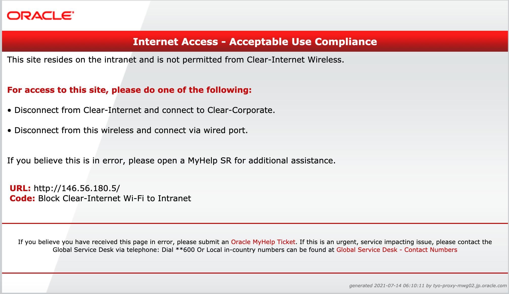
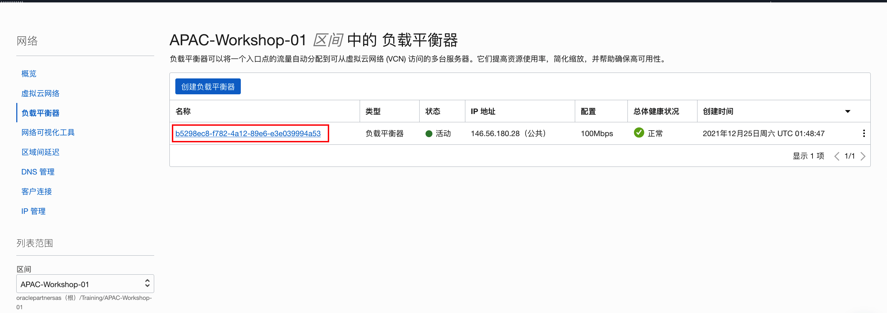
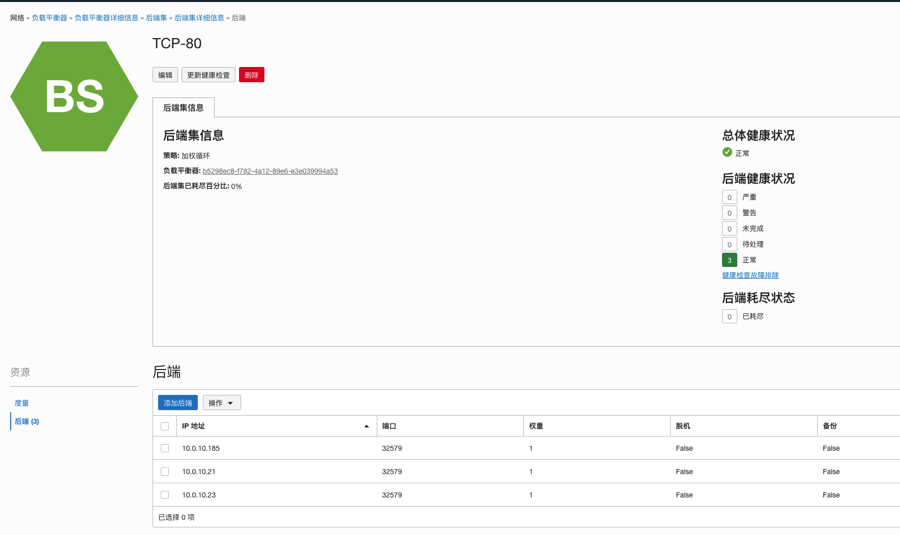
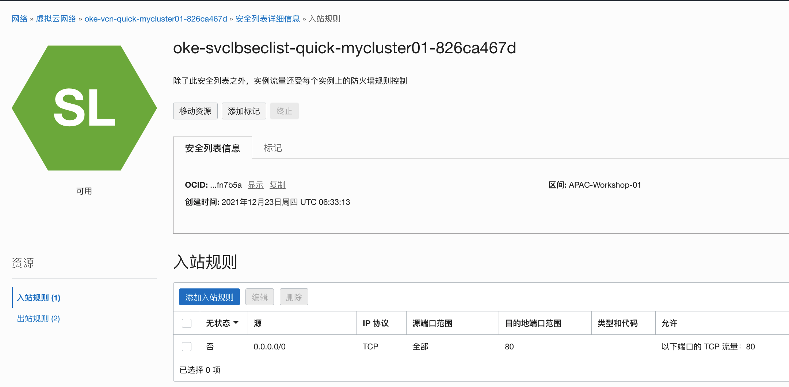

# 部署样例应用程序

## 简介

在创建了Kubernetes集群之后，您可以尝试在集群中的节点上部署应用程序。在下面的步骤中，您将把之前创建的容器镜像部署在集群中，相同的应用程序运行在3个pod中，由一个负载平衡器来在分配给该服务的节点之间分配服务流量。

### 先决条件

- 已经部署了kubernetes集群
- 成功访问kubernetes集群
- 配置了自定义的容器镜像

## Task 1：部署样例应用程序

1. 在虚机终端上，编辑一个文件 `myfirstapp_lb.yaml`。将下面的内容拷贝到文件中。

   - `kind: Deployment`: 为应用程序定义了一个部署
   - `replicas: 3`: 运行3个容器。
   - `image: <your_name>/myfirstapp:1.0`: 要运行的容器镜像，在之前的实验中创建的镜像。请使用你在docker hub中注册的用户名，如果本地镜像不存在，则从远程资料库中获取。 
   - `type: LoadBalancer`: 定义了一个类型为LoadBalancer的服务, 用于负载均衡到后端的应用程序。

   ```
   <copy>
   apiVersion: apps/v1
   kind: Deployment
   metadata:
     name: myapp
     labels:
       app: myapp
   spec:
     replicas: 3
     selector:
       matchLabels:
         app: myapp
     template:
       metadata:
         labels:
           app: myapp
       spec:
         containers:
         - name: myapp
           image: minqiao/myfirstapp:1.0
           ports:
           - containerPort: 5000
             protocol: TCP
   ---
   apiVersion: v1
   kind: Service
   metadata:
     name: myapp-svc
     labels:
       app: myapp
   spec:
     type: LoadBalancer
     ports:
     - port: 80
       protocol: TCP
       targetPort: 5000
     selector:
       app: myapp
   </copy>
   ```

3. 要在kubernetes集群中创建`myfirstapp_lb.yaml`文件中定义的部署和服务，运行下面的命令：

   ```
   $ <copy>kubectl apply -f myfirstapp_lb.yaml</copy>
   deployment.apps/myapp created
   service/myapp-svc created
   ```
   
3. 负载均衡器从挂起状态到完全运行可能需要几分钟的时间。您可以通过输入`kubectl get pod,svc`查看集群中pod和服务的运行状态。pod是kubernetes集群中部署管理的最小单元，每个pod中可以包含一个容器，如本例；也可以包含多个容器，pod中的容器之间共享存储和网络资源。

   ```
   $ <copy>kubectl get pod,svc</copy>
   NAME                        READY   STATUS    RESTARTS   AGE
   pod/myapp-8444c9559-c8lp6   1/1     Running   0          2m1s
   pod/myapp-8444c9559-hrg67   1/1     Running   0          2m1s
   pod/myapp-8444c9559-tzz9w   1/1     Running   0          2m1s
   
   NAME                 TYPE           CLUSTER-IP      EXTERNAL-IP       PORT(S)        AGE
   service/kubernetes   ClusterIP      10.96.0.1       <none>            443/TCP        43h
   service/myapp-svc    LoadBalancer   10.96.239.233   129.154.211.158   80:30573/TCP   2m1s
   
   ```

   - 输出显示`myapp`应用正在3个pod（`pod/myapp-*`）上运行，负载均衡器正在运行（`service/myapp-svc`），并且有一个外部IP（如：129.154.211.158），客户端可以使用该IP连接到部署在集群里的应用程序。

6. 打开浏览器, 输入 url `http://<your_lb_publicIP>`, 你可以看到应用运行正常。

   

7. 如果是在公司内网或其他有限制的网络环境下，会出现下列错误信息，不允许http访问。可以改用其他网络进行访问。

   

6. 

## Task 2：查看部署的应用信息

1. 查看pod信息。

   ```
   $ <copy>kubectl get pod</copy>
   NAME                    READY   STATUS    RESTARTS   AGE
   myapp-8444c9559-228jj   1/1     Running   0          6m4s
   myapp-8444c9559-b4r8h   1/1     Running   0          6m4s
   myapp-8444c9559-kvc7l   1/1     Running   0          6m5s
   ```

   

2. 连接进入其中一个pod。请用你自己的pod名。

   ```
   $ <copy>kubectl exec -it myapp-8444c9559-228jj -- sh</copy>
   / #
   ```

   

3. 可以试着运行容器内的命令，查看运行情况。

   ```
   / # <copy>ps -ef</copy>
   PID   USER     TIME   COMMAND
       1 root       0:00 python /usr/src/app/app.py
       6 root       0:00 sh
      12 root       0:00 ps -ef
   ```

   

4. 退出容器。

   ```
   / # <copy>exit</copy>
   $
   ```

   

5. 查看pod运行日志。请用你自己的pod名。

   ```
   $ <copy>kubectl logs -f myapp-8444c9559-228jj</copy>
    * Running on http://0.0.0.0:5000/ (Press CTRL+C to quit)
   10.244.0.0 - - [25/Dec/2021 01:52:42] "GET /favicon.ico HTTP/1.1" 404 -
   10.244.1.0 - - [25/Dec/2021 01:52:50] "GET / HTTP/1.1" 200 -
   10.244.0.0 - - [25/Dec/2021 01:54:13] "GET / HTTP/1.1" 200 -
   
   ```

   

6. `CTRL+C`退出。

7. 在OCI主页面，点击**主菜单**->**网络**->**负载平衡器**，可以观察到系统自动创建了一个负载平衡器。

   

8. 点击进入负载平衡器，查看当前状态和配置，如，监听，后端集信息等。

   

9. 也可以进入虚拟云网络，查看自动配置的安全列表入站出站规则等。

   

10. 在虚机字符终端，用以下命令来删除部署的应用和负载均衡服务。

   ```
   $ <copy>kubectl delete -f myfirstapp_lb.yaml</copy>
   deployment.apps "myapp" deleted
   service "myapp-svc" deleted
   ```

   

11. 在OCI控制台页面，可以查看到负载平衡器以及对应的安全规则都清除掉了。

    

## Task 3：使用OCI容器注册表里的镜像来部署应用。

1. 要使用OCI容器注册表里的镜像来部署kubernetes应用，我们需要先创建一个secret。命令格式如下：

   ```
   kubectl create secret docker-registry <secret-name> --docker-server=<region-key>.ocir.io --docker-username='<tenancy-namespace>/<oci-username>' --docker-password='<oci-auth-token>' --docker-email='<email-address>'
   ```

   - `<secret-name>`：该secret的命名，如：ocirsecret。
   - `<region-key>`：区域key，如：Seoul是icn，Chuncheon是yny。
   - `<tenancy-namespace>`：对象存储的命名空间，在租户信息页面里可以查询到，如：oraclepartersas。
   - `<oci-username>`：登录OCI的用户名，如：apac-student1。
   - `<oci-auth-token>`：之前创建的令牌，如果使用共享用户apac-student1，则令牌为：`om[v]WJ89-m8oCYE}qgQ`。
   - `<email-address>`：必须输入，但可以输入任何邮件地址。

2. 执行下面的命令创建一个secret，使用自己的相应信息。

   ```
   $ <copy>kubectl create secret docker-registry ocirsecret --docker-server=icn.ocir.io --docker-username='oraclepartnersas/apac-student1' --docker-password='om[v]WJ89-m8oCYE}qgQ' --docker-email='email@null.com'</copy>
   secret/ocirsecret created
   ```

   

3. 编辑一个部署文件：`myocirapp_lb.yaml`，拷贝下列内容到文件中，注意：

   - image：使用你自己的镜像标签。
   - imagePullSecrets：使用前面创建的secret名称。

   ```
   <copy>
   kind: Deployment
   metadata:
     name: myapp2
     labels:
       app: myapp2
   spec:
     replicas: 3
     selector:
       matchLabels:
         app: myapp2
     template:
       metadata:
         labels:
           app: myapp2
       spec:
         containers:
         - name: myapp2
           image: icn.ocir.io/oraclepartnersas/student01:myfirstapp-v1.0
           ports:
           - containerPort: 5000
             protocol: TCP
         imagePullSecrets:
         - name: ocirsecret
   ---
   apiVersion: v1
   kind: Service
   metadata:
     name: myapp2-svc
     labels:
       app: myapp2
   spec:
     type: LoadBalancer
     ports:
     - port: 80
       protocol: TCP
       targetPort: 5000
     selector:
       app: myapp2
   </copy>
   ```

   

4. 部署应用。

   ```
   $ <copy>kubectl apply -f myocirapp_lb.yaml</copy>
   deployment.apps/myapp2 created
   service/myapp2-svc created
   ```

   

5. 可以按照Task 1步骤，查看应用信息。

6. 删除应用。

   ```
   $ <copy>kubectl delete -f myocirapp_lb.yaml</copy>
   deployment.apps "myapp2" deleted
   service "myapp2-svc" deleted
   ```

   

