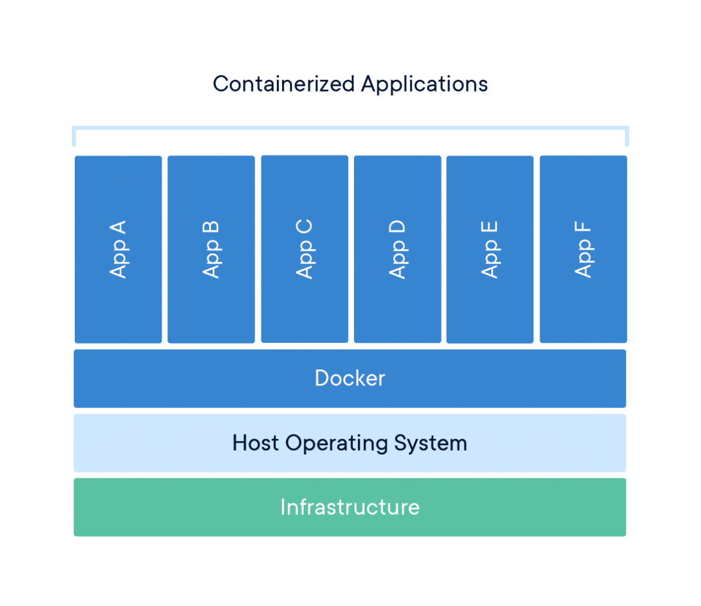
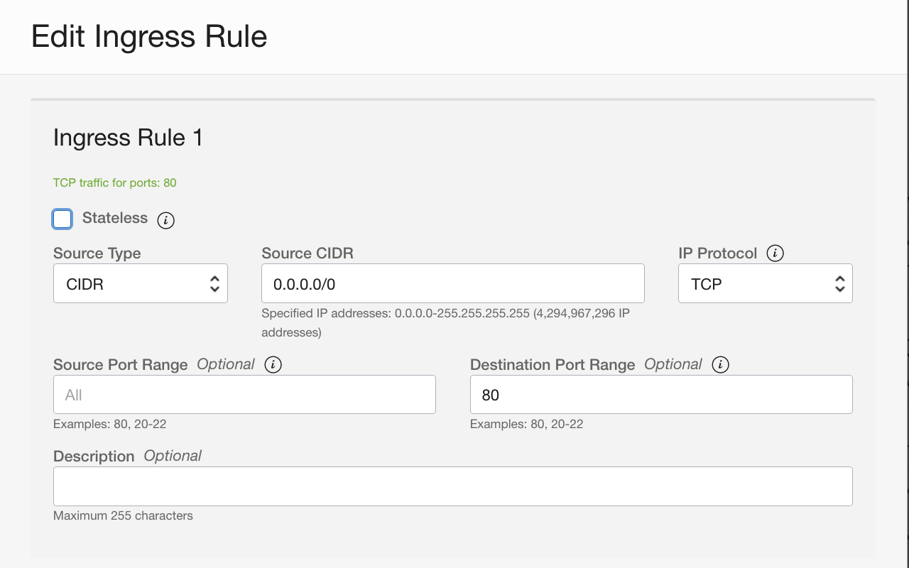
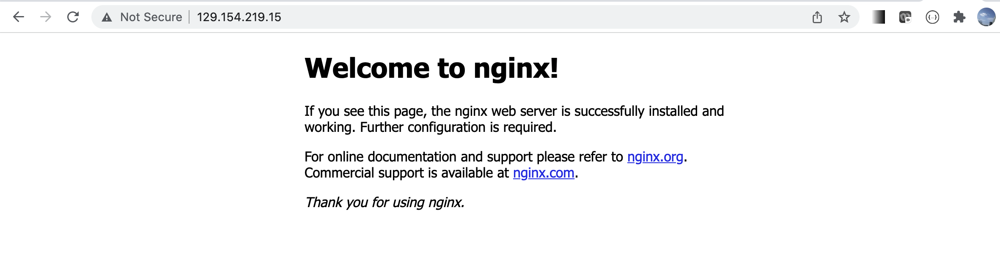

# Docker Container容器基础

## 简介

容器是打包代码及其所有依赖项的标准软件单元，因此应用程序可以从一个计算环境快速可靠地运行到另一个计算环境。 常用的容器运行时（container runtime）包括docker，containerd，rkt，katacontainer等等。容器镜像（image）是一个轻量级、独立、可执行的软件包，其中包括运行应用程序所需的一切：代码、运行时、系统工具、系统库和设置。容器镜像在运行时成为容器，以docker容器为例 - 镜像在 docker引擎上运行时成为容器。 可用于基于 Linux 和 Windows 的应用程序，无论基础架构如何，容器化软件始终是相同的运行。 容器将软件与其环境隔离开来，并确保它能够一致地工作。



### 实验目标

在本练习中，你将学会如何安装Docker环境，如何创建容器镜像，如何保存镜像到远程资料库，如何运行容器以及容器的管理等等。

### 先决条件

- 在OCI上创建一个VM，操作系统为Oracle Linux 7.9，机型选用缺省设置。
- 在hub.docker.com上注册一个账号，用来存储容器镜像。


## Task 1：安装配置Docker环境

1. 使用opc用户连接到所创建的Linux虚机。运行下列命令安装docker引擎。

    ```
    $ <copy>sudo yum -y install docker-engine</copy>
    ```

    

2. 授权opc用户使用docker命令

    ```
    $ <copy>sudo usermod -aG docker opc</copy>
    ```

    

3. 启动docker环境

    ```
    $ <copy>sudo systemctl enable docker</copy>
    $ <copy>sudo systemctl start docker</copy>
    ```


## Task 2: 运行你的第一个容器

1. 从远程资料库（缺省为hub.docker.com)中拉取一个容器镜像到本地。例如，我们可以拉取一个nginx容器镜像。

    ```
    $ <copy>docker pull nginx</copy>
    Using default tag: latest
    Trying to pull repository docker.io/library/nginx ... 
    latest: Pulling from docker.io/library/nginx
    a2abf6c4d29d: Pull complete 
    f3409a9a9e73: Pull complete 
    9919a6cbae9c: Pull complete 
    fc1ce43285d7: Pull complete 
    1f01ab499216: Pull complete 
    13cfaf79ff6d: Pull complete 
    Digest: sha256:366e9f1ddebdb844044c2fafd13b75271a9f620819370f8971220c2b330a9254
    Status: Downloaded newer image for nginx:latest
    nginx:latest
    ```

    

2. 查看当前镜像

    ```
    $ <copy>docker image ls</copy>
    REPOSITORY          TAG                 IMAGE ID            CREATED             SIZE
    nginx               latest              f6987c8d6ed5        24 hours ago        141MB
    ```

    

3. 基于镜像启动容器。如果镜像不存在，docker会自动去远程资料库拉取镜像文件。

    ```
    $ <copy>docker run -d -it -p 80:80 --name my-nginx nginx</copy>
    d69ac4187f0da6bc41a9e3f8288e07d7a7c8545563f6322dc6ba3a5ca7da3fa1
    ```

    

4. 查看容器运行状态，该容器名字为`my-nginx`，本虚机的80端口映射到容器的80端口。

    ```
    $ <copy>docker ps -a</copy>
    CONTAINER ID        IMAGE               COMMAND                  CREATED             STATUS              PORTS                NAMES
    d72bfc7ef659        nginx               "/docker-entrypoint.…"   16 seconds ago      Up 15 seconds       0.0.0.0:80->80/tcp   my-nginx
    ```

    

5. 我们可以连接进入该容器，缺省进入该容器根目录下。

    ```
    $ <copy>docker exec -it my-nginx bash</copy>
    root@9270794f6c08:/# 
    ```

    

6. 我们可以在容器内试着运行Linux命令。

    ```
    root@9270794f6c08:/# <copy>ls</copy>
    bin   dev		   docker-entrypoint.sh  home  lib64  mnt  proc  run   srv  tmp  var
    boot  docker-entrypoint.d  etc			 lib   media  opt  root  sbin  sys  usr
    root@9270794f6c08:/# 
    ```

    

7. 查看该容器的ip地址，可以看到该主机名就是CONTAINER ID。

    ```
    root@9270794f6c08:/# <copy>cat /etc/hosts</copy>
    127.0.0.1	localhost
    ::1	localhost ip6-localhost ip6-loopback
    fe00::0	ip6-localnet
    ff00::0	ip6-mcastprefix
    ff02::1	ip6-allnodes
    ff02::2	ip6-allrouters
    172.17.0.2	9270794f6c08
    root@9270794f6c08:/# 
    ```

    

8. 退出容器连接。

    ```
    root@9270794f6c08:/# <copy>exit</copy>
    exit
    $
    ```

    

9. 访问nginx容器80端口。使用刚才查询到的容器ip地址。

    ```
    $ <copy>curl http://172.17.0.2</copy>
    <!DOCTYPE html>
    <html>
    <head>
    <title>Welcome to nginx!</title>
    <style>
    html { color-scheme: light dark; }
    body { width: 35em; margin: 0 auto;
    font-family: Tahoma, Verdana, Arial, sans-serif; }
    </style>
    </head>
    <body>
    <h1>Welcome to nginx!</h1>
    <p>If you see this page, the nginx web server is successfully installed and
    working. Further configuration is required.</p>
    
    <p>For online documentation and support please refer to
    <a href="http://nginx.org/">nginx.org</a>.<br/>
    Commercial support is available at
    <a href="http://nginx.com/">nginx.com</a>.</p>
    
    <p><em>Thank you for using nginx.</em></p>
    </body>
    </html>
    ```

    

10. 要让外部客户端访问虚机的80端口，我们必须先修改一下防火墙的设置。运行下列命令。

    ```
    $ <copy>sudo firewall-cmd --zone=public --add-port=80/tcp --permanent</copy>
    $ <copy>sudo firewall-cmd --reload</copy>
    ```

    

11. 另外，我们需要修改虚机所在的VCN公共子网的的安全规则，添加入站规则，允许访问80端口。

    

12. 打开浏览器，访问`http://<VM-publicIP>:80`，在运行容器时我们设置了端口映射，所以通过虚机的80端口可以访问到容器的nginx服务。

    

13. 停止该容器。

    ```
    $ <copy>docker stop my-nginx</copy>
    my-nginx
    ```

    

14. 删除该容器。

    ```
    $ <copy>docker rm my-nginx</copy>
    my-nginx
    ```

    

15. sdaf


## Task 3：创建一个自己的容器镜像

你可以从头开始创建容器镜像，也可以使用一个现有的镜像，在里面安装自己的应用。下面我们会从一个现有镜像alpine开始。Alpine是一个轻量级的Linux发行版，包含linux的核心组件。我们已经写好了一个python应用，该程序在每次调用时会随机加载一些图片。

1. 下载应用程序

    ```
    $ <copy>wget https://github.com/minqiaowang/oci-k8s-cn/raw/main/docker-container-fundation/flask-app.zip</copy>
    --2021-12-22 03:38:05--  https://github.com/minqiaowang/oci-k8s-cn/raw/main/docker-container-fundation/flask-app.zip
    Resolving github.com (github.com)... 15.164.81.167
    Connecting to github.com (github.com)|15.164.81.167|:443... connected.
    HTTP request sent, awaiting response... 302 Found
    Location: https://raw.githubusercontent.com/minqiaowang/oci-k8s-cn/main/docker-container-fundation/flask-app.zip [following]
    --2021-12-22 03:38:05--  https://raw.githubusercontent.com/minqiaowang/oci-k8s-cn/main/docker-container-fundation/flask-app.zip
    Resolving raw.githubusercontent.com (raw.githubusercontent.com)... 185.199.108.133, 185.199.109.133, 185.199.110.133, ...
    Connecting to raw.githubusercontent.com (raw.githubusercontent.com)|185.199.108.133|:443... connected.
    HTTP request sent, awaiting response... 200 OK
    Length: 2485 (2.4K) [application/zip]
    Saving to: 'flask-app.zip'
    
    100%[========================================================================================>] 2,485       --.-K/s   in 0s      
    
    2021-12-22 03:38:06 (25.9 MB/s) - 'flask-app.zip' saved [2485/2485]
    ```

    

2. 解压zip文件。

    ```
    $ <copy>unzip flask-app.zip</copy> 
    Archive:  flask-app.zip
       creating: flask-app/
      inflating: flask-app/.DS_Store     
      inflating: __MACOSX/flask-app/._.DS_Store  
      inflating: flask-app/requirements.txt  
      inflating: flask-app/app.py        
       creating: flask-app/templates/
      inflating: flask-app/templates/index.html
    ```

    

3. 进入子目录。感兴趣的可以查看一下该python应该的脚本。

    ```
    $ <copy>cd flask-app</copy>
    $ <copy>ls</copy>
    app.py  requirements.txt  templates
    ```

    

4. 在该目录下编辑一个名为Dockerfile的文件。拷贝如下内容到该文件中。

    ```
    <copy>
    # our base image
    FROM alpine:3.5
    
    # Install python and pip
    RUN apk add --update py2-pip
    
    # install Python modules needed by the Python app
    COPY requirements.txt /usr/src/app/
    RUN pip install --no-cache-dir -r /usr/src/app/requirements.txt
    
    # copy files required for the app to run
    COPY app.py /usr/src/app/
    COPY templates/index.html /usr/src/app/templates/
    
    # tell the port number the container should expose
    EXPOSE 5000
    
    # run the application
    CMD ["python", "/usr/src/app/app.py"]
    </copy>
    ```

    Dockerfile是用来构建docker image的描述文件，在该文件中我们可以看到镜像文件的生成过程。

    - 从基础镜像alpine:3.5开始
    - 安装python和pip包
    - 安装应用所需的模块
    - 拷贝应用程序到容器内部相应目录
    - 在容器内部打开5000端口
    - 容器启动时要运行的应用程序

5. 生成容器镜像，命名为`myfirstapp:1.0`。

    ```
    $ <copy>docker build -t myfirstapp:1.0 .</copy>
    Sending build context to Docker daemon  14.85kB
    Step 1/8 : FROM alpine:3.5
    Trying to pull repository docker.io/library/alpine ... 
    3.5: Pulling from docker.io/library/alpine
    8cae0e1ac61c: Pull complete 
    Digest: sha256:66952b313e51c3bd1987d7c4ddf5dba9bc0fb6e524eed2448fa660246b3e76ec
    Status: Downloaded newer image for alpine:3.5
     ---> f80194ae2e0c
    Step 2/8 : RUN apk add --update py2-pip
     ---> Running in bb78edb6a44d
    fetch http://dl-cdn.alpinelinux.org/alpine/v3.5/main/x86_64/APKINDEX.tar.gz
    fetch http://dl-cdn.alpinelinux.org/alpine/v3.5/community/x86_64/APKINDEX.tar.gz
    (1/12) Installing libbz2 (1.0.6-r5)
    (2/12) Installing expat (2.2.0-r1)
    (3/12) Installing libffi (3.2.1-r2)
    (4/12) Installing gdbm (1.12-r0)
    (5/12) Installing ncurses-terminfo-base (6.0_p20171125-r1)
    (6/12) Installing ncurses-terminfo (6.0_p20171125-r1)
    (7/12) Installing ncurses-libs (6.0_p20171125-r1)
    (8/12) Installing readline (6.3.008-r4)
    (9/12) Installing sqlite-libs (3.15.2-r2)
    (10/12) Installing python2 (2.7.15-r0)
    (11/12) Installing py-setuptools (29.0.1-r0)
    (12/12) Installing py2-pip (9.0.0-r1)
    Executing busybox-1.25.1-r2.trigger
    OK: 62 MiB in 23 packages
    Removing intermediate container bb78edb6a44d
     ---> b02d3b07c818
    Step 3/8 : COPY requirements.txt /usr/src/app/
     ---> cc3d3ceb15be
    Step 4/8 : RUN pip install --no-cache-dir -r /usr/src/app/requirements.txt
     ---> Running in 5b59f6d7b137
    Collecting Flask==0.10.1 (from -r /usr/src/app/requirements.txt (line 1))
      Downloading https://files.pythonhosted.org/packages/db/9c/149ba60c47d107f85fe52564133348458f093dd5e6b57a5b60ab9ac517bb/Flask-0.10.1.tar.gz (544kB)
    Collecting Werkzeug>=0.7 (from Flask==0.10.1->-r /usr/src/app/requirements.txt (line 1))
      Downloading https://files.pythonhosted.org/packages/cc/94/5f7079a0e00bd6863ef8f1da638721e9da21e5bacee597595b318f71d62e/Werkzeug-1.0.1-py2.py3-none-any.whl (298kB)
    Collecting Jinja2>=2.4 (from Flask==0.10.1->-r /usr/src/app/requirements.txt (line 1))
      Downloading https://files.pythonhosted.org/packages/7e/c2/1eece8c95ddbc9b1aeb64f5783a9e07a286de42191b7204d67b7496ddf35/Jinja2-2.11.3-py2.py3-none-any.whl (125kB)
    Collecting itsdangerous>=0.21 (from Flask==0.10.1->-r /usr/src/app/requirements.txt (line 1))
      Downloading https://files.pythonhosted.org/packages/76/ae/44b03b253d6fade317f32c24d100b3b35c2239807046a4c953c7b89fa49e/itsdangerous-1.1.0-py2.py3-none-any.whl
    Collecting MarkupSafe>=0.23 (from Jinja2>=2.4->Flask==0.10.1->-r /usr/src/app/requirements.txt (line 1))
      Downloading https://files.pythonhosted.org/packages/b9/2e/64db92e53b86efccfaea71321f597fa2e1b2bd3853d8ce658568f7a13094/MarkupSafe-1.1.1.tar.gz
    Installing collected packages: Werkzeug, MarkupSafe, Jinja2, itsdangerous, Flask
      Running setup.py install for MarkupSafe: started
        Running setup.py install for MarkupSafe: finished with status 'done'
      Running setup.py install for Flask: started
        Running setup.py install for Flask: finished with status 'done'
    Successfully installed Flask-0.10.1 Jinja2-2.11.3 MarkupSafe-1.1.1 Werkzeug-1.0.1 itsdangerous-1.1.0
    You are using pip version 9.0.0, however version 21.3.1 is available.
    You should consider upgrading via the 'pip install --upgrade pip' command.
    Removing intermediate container 5b59f6d7b137
     ---> 81c39cee7cb6
    Step 5/8 : COPY app.py /usr/src/app/
     ---> 2c5e3d5efbac
    Step 6/8 : COPY templates/index.html /usr/src/app/templates/
     ---> f2fc0a841eb8
    Step 7/8 : EXPOSE 5000
     ---> Running in 06cec8049ad2
    Removing intermediate container 06cec8049ad2
     ---> 2444522f32fd
    Step 8/8 : CMD ["python", "/usr/src/app/app.py"]
     ---> Running in 04dedc5a224c
    Removing intermediate container 04dedc5a224c
     ---> 5a0f4c662bec
    Successfully built 5a0f4c662bec
    Successfully tagged myfirstapp:1.0
    ```

    

6. 查看当前镜像

    ```
    $ docker image ls
    REPOSITORY          TAG                 IMAGE ID            CREATED             SIZE
    myfirstapp          1.0                 5a0f4c662bec        2 minutes ago       56.8MB
    nginx               latest              f6987c8d6ed5        25 hours ago        141MB
    alpine              3.5                 f80194ae2e0c        2 years ago         4MB
    ```

    

7. 运行该镜像， 同样我们也做了端口映射。

    ```
    docker run -p 80:5000 --name myfirstapp myfirstapp:1.0
    ```

    

8. sdaf

9. 

