# Create a Kubernetes Cluster

Oracle Cloud Infrastructure Container Engine for Kubernetes is a fully-managed, scalable, and highly available service that you can use to deploy your containerized applications to the cloud. Use Container Engine for Kubernetes (sometimes abbreviated to just OKE) when your development team wants to reliably build, deploy, and manage cloud-native applications. You specify the compute resources that your applications require, and Container Engine for Kubernetes provisions them on Oracle Cloud Infrastructure in an existing OCI tenancy.

Container Engine for Kubernetes uses Kubernetes - the open-source system for automating deployment, scaling, and management of containerized applications across clusters of hosts. Kubernetes groups the containers that make up an application into logical units (called pods) for easy management and discovery. Container Engine for Kubernetes uses versions of Kubernetes certified as conformant by the [Cloud Native Computing Foundation (CNCF)](https://github.com/cncf/k8s-conformance).

In this lab, you will learn how to create a Kubernetes Cluster and deploy applications on the cluster.

## Before You Begin

- You must have access to an Oracle Cloud Infrastructure tenancy in which Container Engine for Kubernetes is available.
- Your tenancy must have sufficient quota on different types of resource, such as: Compute instance quota, Block volume quota, Load balancer quota, etc.
- To create and/or manage clusters, you must belong to a group to which a policy grants the appropriate Container Engine for Kubernetes permissions. 
- A policy set in the root compartment with the statement is ```allow service OKE to manage all-resources in tenancy```.
- A SSH Key pair that you can use to access the worker nodes and the bastion host.

##Create a 'Quick Cluster' with Default Settings

1. Log in the OCI Console, open the navigation menu. Under **Solutions and Platform**, go to **Developer Services** and click **Container Clusters(OKE)**.

   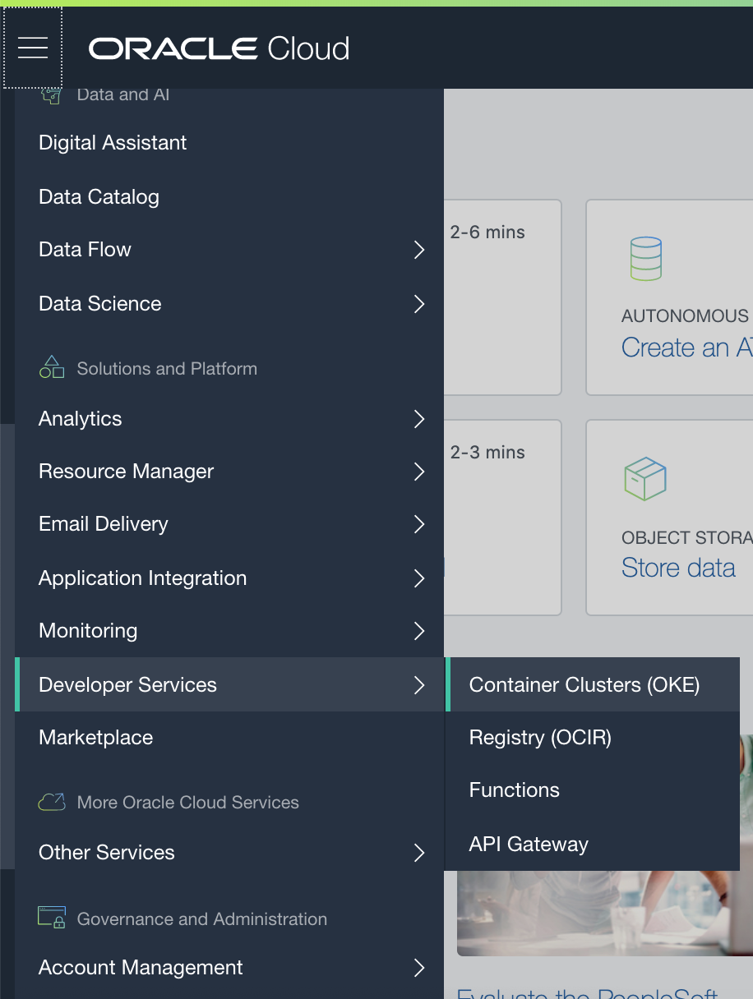

2. Choose a **Compartment** you have permission to work in. On the **Cluster List** page, click **Create Cluster**.

   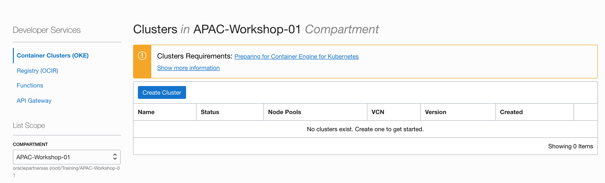

3. In the **Create Cluster Solution** dialog, select **Quick Create** and click **Launch Workflow**.

   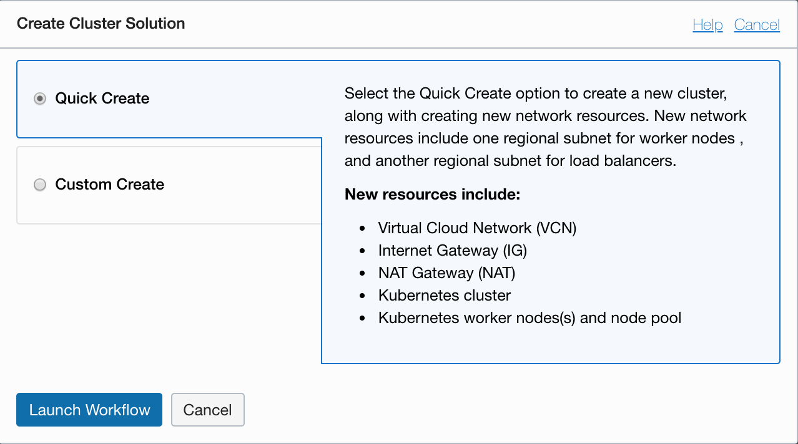

4. On the **Create Cluster** page, either just accept the default configuration details for the new cluster, or specify alternatives as follows:

   - **Name:** mycluster
   - **Compartment:** The compartment in which to create the new cluster and the associated network resources.
   - **Kubernetes Version:** Accept the default version.
   - **Visibility Type:** Accept the default: Private
   - **Shape:** VM.Standard2.1
   - **Number of Nodes:** Accept the default value: 3

   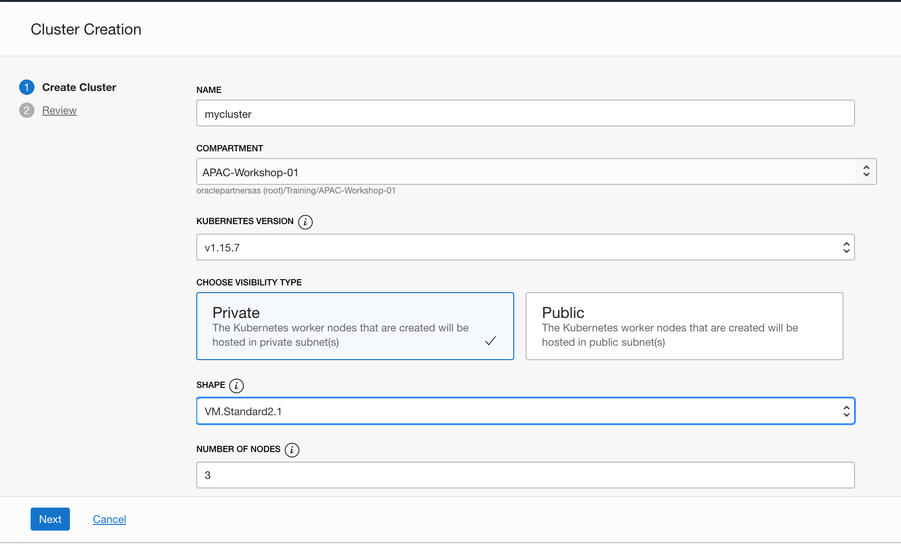

5. Click **Show Advanced Options**, copy and paste the SSH public Key which you prepared before. The public key is installed on all worker nodes in the cluster. You will  have SSH access to the worker nodes with the SSH key pair.

   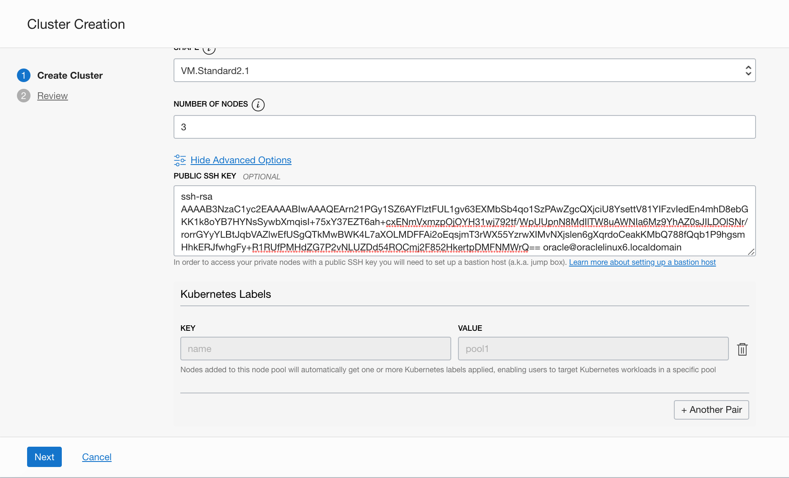

6. Enable Kubernetes Dashboard and Tiller (Helm) so you can use to manage the kubernetes resources.

   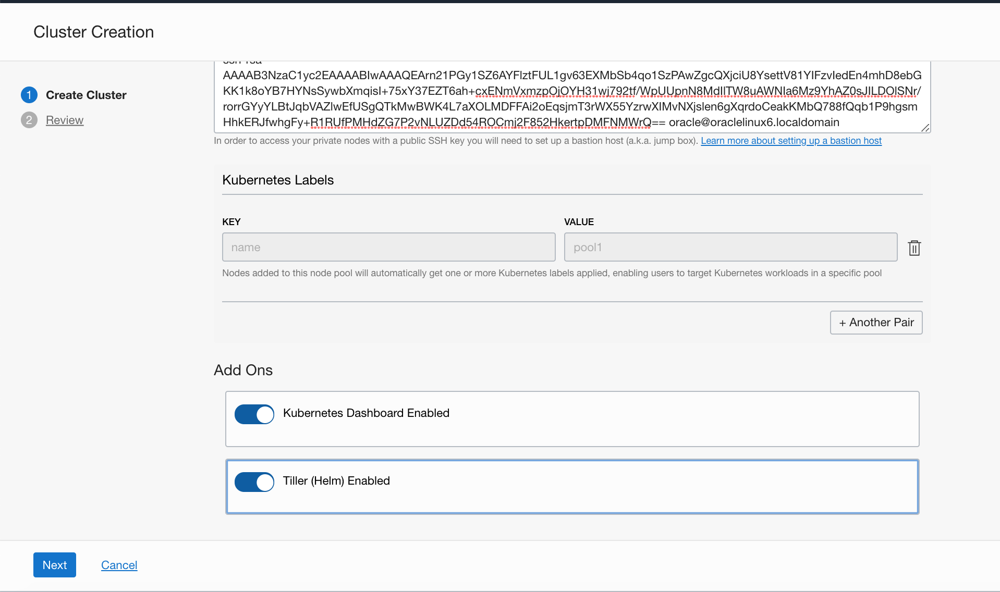

7. Click **Next** to review the details you entered for the new cluster.

   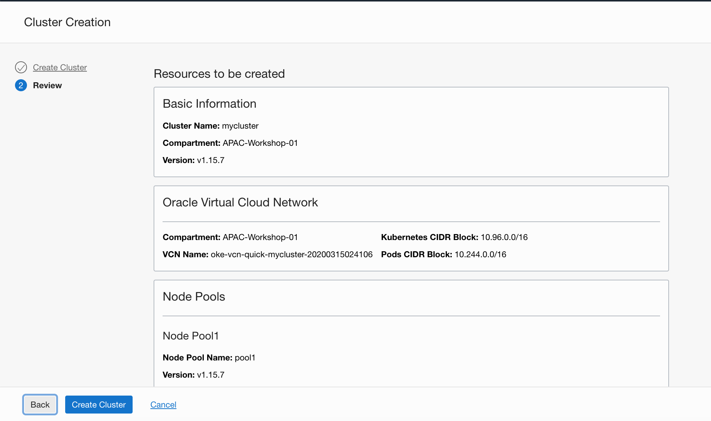

8. Click **Create Cluster** to create the new network resources and the new cluster.

   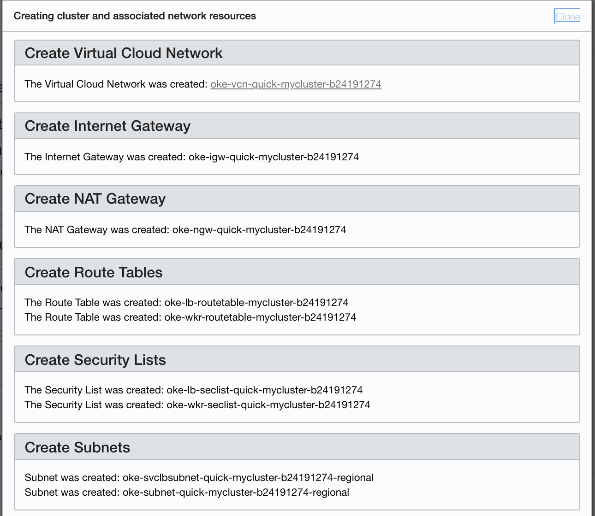

9. Click **Close** to return to the Console.

   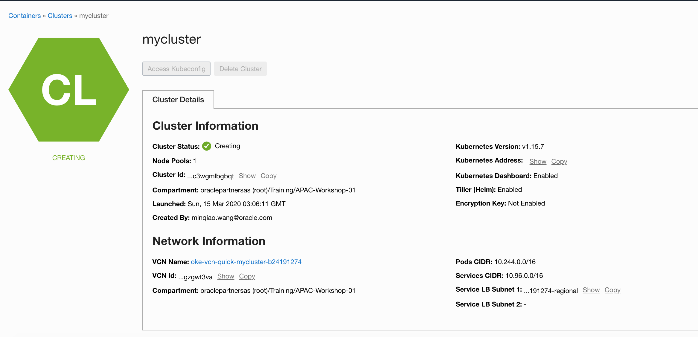

10. Initially, the new cluster appears in the Console with a status of Creating. When the cluster has been created, it has a status of Active.

    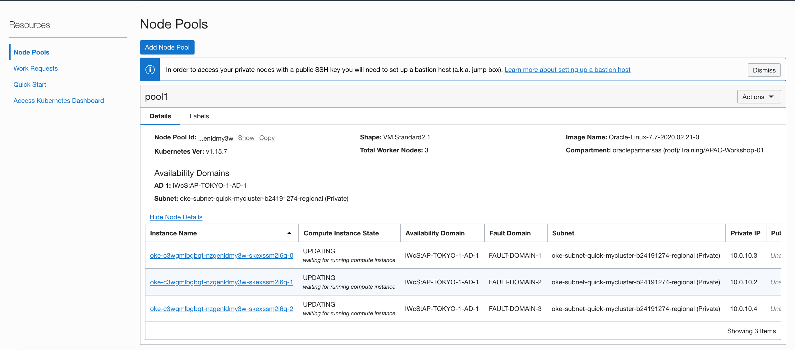

11. After the all the **Compute Instance State** change to **Active**, your kubernetes cluster is ready. Container Engine for Kubernetes also creates a Kubernetes kubeconfig configuration file that you use to access the cluster using kubectl and the Kubernetes Dashboard.

    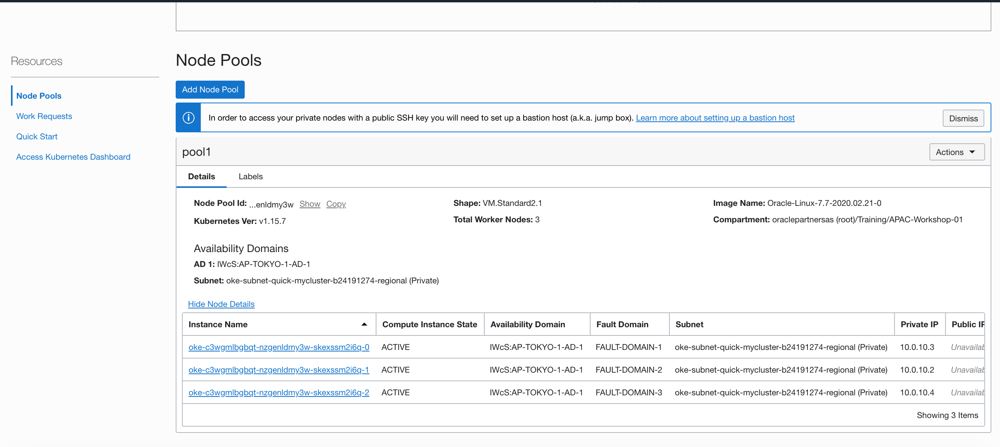

    


