# Accessing a Kubernetes Cluster

You can use the Kubernetes command line tool kubectl to perform operations on a cluster you've created with Container Engine for Kubernetes. Before you can use kubectl to access a cluster, you need to specify the cluster on which to perform operations by downloading the cluster's kubeconfig file. Oracle Kubernetes Console privide a out-of-box kubectl environment to manage the cluster. or you can setup your own environment to use the kubectl. 

##Accessing a Cluster using Cloud Shell

1. In the kubernetes cluster page, click **Access Cluster**.

   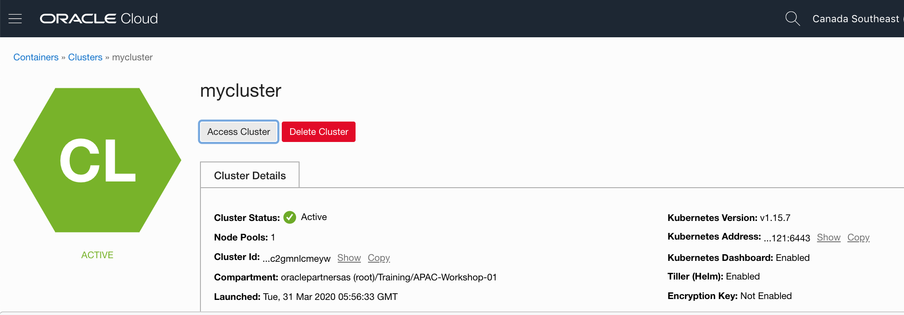

   

2. In the popup window, Click **Copy** for the kubeconfig command.

   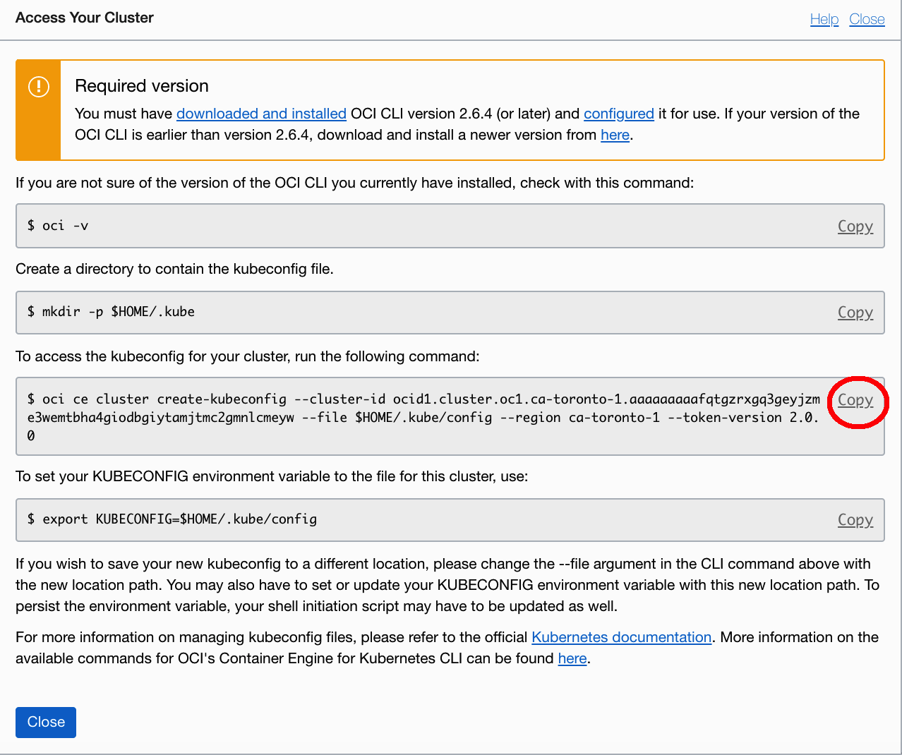

   

3. Click **Cloud Shell** icon in the upper right of the console header.

   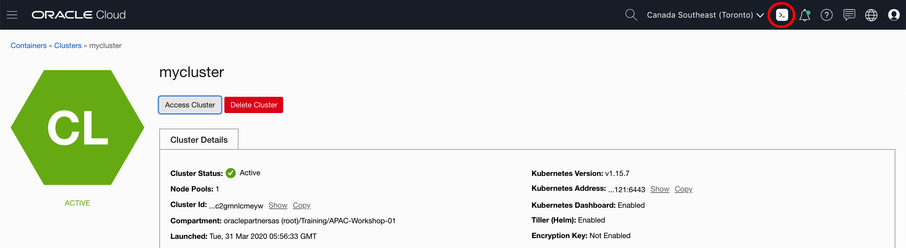

   

4. The Cloud Shell terminal will appear in the bottom of the page. 

   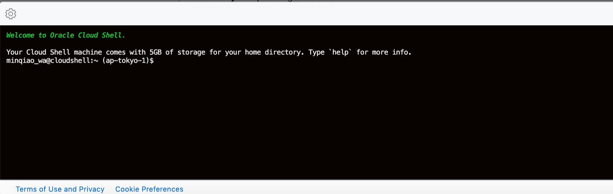

   

5. Paste the command from the step 2 and execute it.

   ```
   oci ce cluster create-kubeconfig --cluster-id ocid1.cluster.oc1.ap-tokyo-1.aaaaa***gbqt --file $HOME/.kube/config --region ap-tokyo-1 --token-version 2.0.0 
   ```

   

6. Now you can use the kubectl in Cloud Shell to manage the kubernetes cluster. Try to run the following command:

   ```
   $ kubectl version
   Client Version: version.Info{Major:"1", Minor:"14", GitVersion:"v1.14.10", GitCommit:"575467a0eaf3ca1f20eb86215b3bde40a5ae617a", GitTreeState:"clean", BuildDate:"2019-12-11T12:41:00Z", GoVersion:"go1.12.12", Compiler:"gc", Platform:"linux/amd64"}
   Server Version: version.Info{Major:"1", Minor:"15", GitVersion:"v1.15.7", GitCommit:"4f504dd9ee54a3621502518bc64f0df487587d12", GitTreeState:"clean", BuildDate:"2020-01-23T00:34:28Z", GoVersion:"go1.12.7 BoringCrypto", Compiler:"gc", Platform:"linux/amd64"}
   $ kubectl get nodes
   NAME        STATUS   ROLES   AGE   VERSION
   10.0.10.2   Ready    node    49m   v1.15.7
   10.0.10.3   Ready    node    49m   v1.15.7
   10.0.10.4   Ready    node    49m   v1.15.7
   $ 
   ```


##Accessing a Cluster using a Bastion Host

In the lab1, we choose private network when deploy the kubernetes cluster, so you can not access the worker nodes directly. In the following steps, we will create a bastion host to use to manage the cluster and access the worker notes.

### Step1. Provisioning a Compute Instance in the public subnet

1. In the OCI Console, open the navigation menu. Under **Core Infrastructure**, go to **Compute** and click **Instances**.

   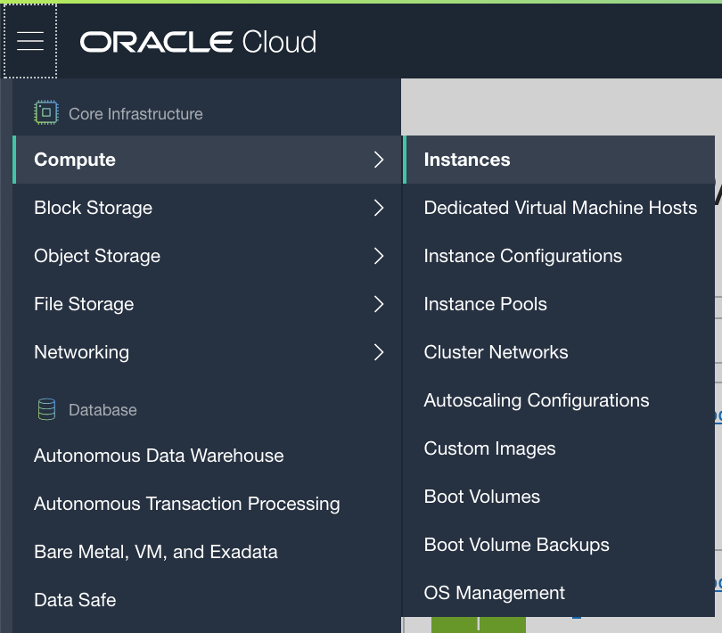

2. Make sure you are in the correct region and compartment. Click **Create Instance**

   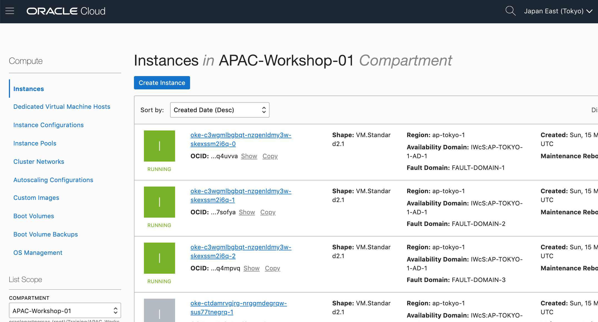

3. In the Create Compute Instance page, name your instance like: *OKE-bastion*, accept the default **Image Source, AD, Instance Type** and **Shape**.

   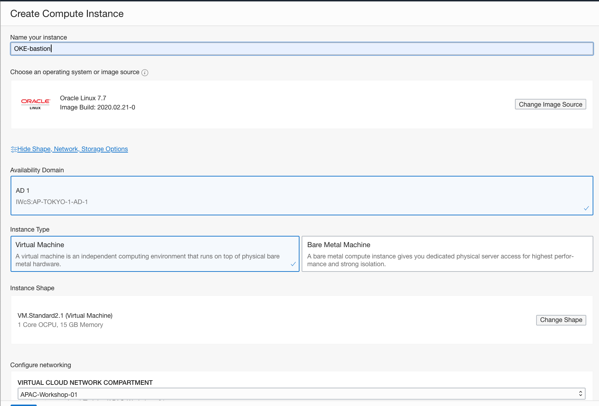

   

4. Choose the VCN created in the lab1 by default, which name begin with: *oke-vcn-quick-mycluster-*. Choose the public subnet wich name begin with: *oke-svclbsubnet-quick-mycluster-*. Make sure click the **Assign a Public IP Address**.

   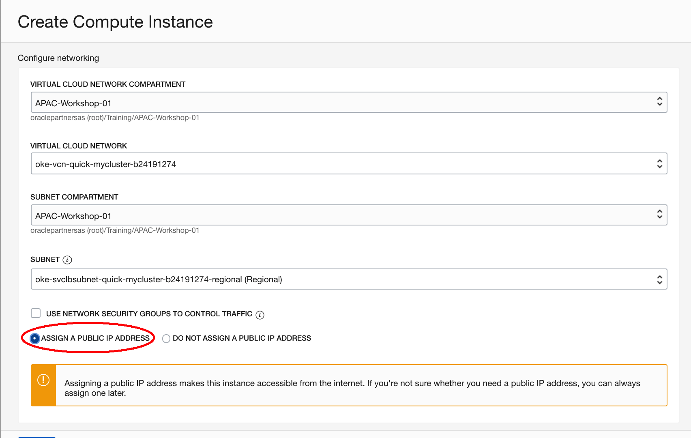

5. Browse and select the SSH public key you prepared before, and click **Create**.

   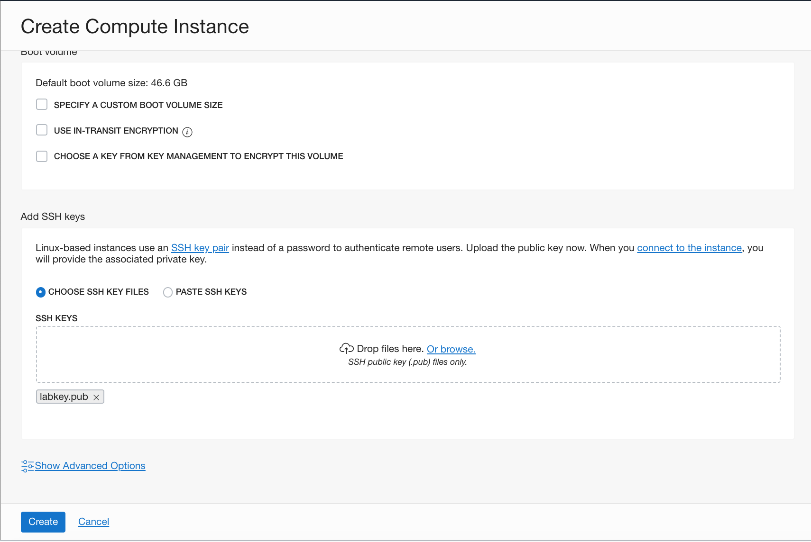

6. Wait until the instance is ready. copy and write down the public ip address.

   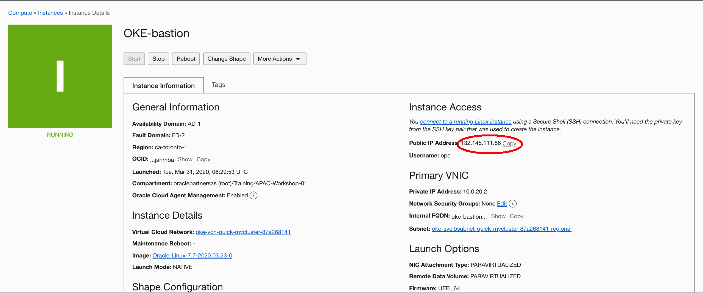
   
   

### Step2. Install and Configure the OCI CLI

1. Connect to the bastion host using SSH(use putty in Windows)

   ```
   $ ssh -i labkey opc@xxx.xxx.xxx.xxx
   ```

2. Run the following script to install the OCI CLI

   ```
   $ bash -c "$(curl -L https://raw.githubusercontent.com/oracle/oci-cli/master/scripts/install/install.sh)"
   ```

3. Accept all the default vaules

   ```
     Stored in directory: /tmp/tmp582hHd/wheels/f0/11/d1/8902b10e29e3ce2c8965a86533b76894c844565e02d5341520
     Building wheel for configparser (setup.py) ... done
     Created wheel for configparser: filename=configparser-3.5.0-py2-none-any.whl size=21661 sha256=62b501d9a4a5d17b2559eedf67e6a100ca8e5300e795839bad239bfcfec939df
     Stored in directory: /tmp/tmp582hHd/wheels/fe/e1/b2/ffea2d060a50955b9228e7a1dc7b1fc7a5013dc506da8c5272
   Successfully built PyYAML retrying terminaltables configparser
   Installing collected packages: six, pycparser, cffi, ipaddress, enum34, cryptography, certifi, PyYAML, python-dateutil, pyOpenSSL, pytz, configparser, oci, jmespath, retrying, idna, terminaltables, backports.functools-lru-cache, arrow, click, oci-cli
   Successfully installed PyYAML-5.1.2 arrow-0.14.7 backports.functools-lru-cache-1.6.1 certifi-2019.11.28 cffi-1.14.0 click-6.7 configparser-3.5.0 cryptography-2.8 enum34-1.1.10 idna-2.6 ipaddress-1.0.23 jmespath-0.9.4 oci-2.11.0 oci-cli-2.9.6 pyOpenSSL-18.0.0 pycparser-2.20 python-dateutil-2.8.1 pytz-2019.3 retrying-1.3.3 six-1.14.0 terminaltables-3.1.0
   
   ===> Modify profile to update your $PATH and enable shell/tab completion now? (Y/n): Y
   
   ===> Enter a path to an rc file to update (leave blank to use '/home/opc/.bashrc'): 
   -- Backed up '/home/opc/.bashrc' to '/home/opc/.bashrc.backup'
   -- Tab completion set up complete.
   -- If tab completion is not activated, verify that '/home/opc/.bashrc' is sourced by your shell.
   -- 
   -- ** Run `exec -l $SHELL` to restart your shell. **
   -- 
   -- Installation successful.
   -- Run the CLI with /home/opc/bin/oci --help
   [opc@oke-bastion ~]$ 
   ```

4. Run `exec -l $SHELL` to restart your shell.

   ```
   [opc@oke-bastion ~]$ exec -l $SHELL
   [opc@oke-bastion ~]$
   ```

5. Use the `oci setup config` command to configure the OCI CLI. Accept the default directory Copy and paste the tenant and user ocid(refer to the [doc](https://docs.cloud.oracle.com/en-us/iaas/Content/API/Concepts/apisigningkey.htm#Other)). let it generate a new RSA key pair. 

   ```
   [opc@oke-bastion ~]$ oci setup config
       This command provides a walkthrough of creating a valid CLI config file.
   
       The following links explain where to find the information required by this
       script:
   
       User OCID and Tenancy OCID:
   
           https://docs.cloud.oracle.com/Content/API/Concepts/apisigningkey.htm#Other
   
       Region:
   
           https://docs.cloud.oracle.com/Content/General/Concepts/regions.htm
   
       General config documentation:
   
           https://docs.cloud.oracle.com/Content/API/Concepts/sdkconfig.htm
   
   
   Enter a location for your config [/home/opc/.oci/config]: 
   Enter a user OCID: ocid1.user.oc1..aaaaaaaau4a24oyl3bj2ings4uzmuhcv7a27jhw6mdu3nqb2aoqs7e4pjmpa
   Enter a tenancy OCID: ocid1.tenancy.oc1..aaaaaaaafj37mytx22oquorcznlfuh77cd45int7tt7fo27tuejsfqbybzrq
   Enter a region (e.g. ap-melbourne-1, ap-mumbai-1, ap-osaka-1, ap-seoul-1, ap-sydney-1, ap-tokyo-1, ca-montreal-1, ca-toronto-1, eu-amsterdam-1, eu-frankfurt-1, eu-zurich-1, me-jeddah-1, sa-saopaulo-1, uk-gov-london-1, uk-london-1, us-ashburn-1, us-gov-ashburn-1, us-gov-chicago-1, us-gov-phoenix-1, us-langley-1, us-luke-1, us-phoenix-1): ap-tokyo-1
   Do you want to generate a new RSA key pair? (If you decline you will be asked to supply the path to an existing key.) [Y/n]: Y
   Enter a directory for your keys to be created [/home/opc/.oci]: 
   Enter a name for your key [oci_api_key]: 
   Public key written to: /home/opc/.oci/oci_api_key_public.pem
   Enter a passphrase for your private key (empty for no passphrase): 
   Private key written to: /home/opc/.oci/oci_api_key.pem
   Fingerprint: 87:26:7c:f8:0c:dd:6f:d5:e1:d4:c9:60:54:ec:96:9c
   Config written to /home/opc/.oci/config
   
   
       If you haven't already uploaded your public key through the console,
       follow the instructions on the page linked below in the section 'How to
       upload the public key':
   
           https://docs.cloud.oracle.com/Content/API/Concepts/apisigningkey.htm#How2
   
   
   [opc@oke-bastion ~]$ 
   ```

6. Cat the content of the public key, copy it for the next step.

   ```
   [opc@oke-bastion ~]$ cat .oci/oci_api_key_public.pem 
   -----BEGIN PUBLIC KEY-----
   MIIBIjANBgkqhkiG9w0BAQEFAAOCAQ8AMIIBCgKCAQEAs+vNX8kMsQmh5TSX73Ha
   jRfd7dJ7OnmSt125yVMI8X74E6QpGV7Ml6L3/drT8RpzsZM+hLtgFEFJlc2NWDyz
   9/PijQDGia4KyGR5/9+QBh4vjqSKuis44ppQKknRLEkn0BmKkQn8w5yaQ5WK9iav
   Kndllrm0L02HvNjlQ5McDZVzqVeGC2Wn+NKceT1K2z3ZSIhB6U99gtNh2gkHKHxe
   q/OedrlIMeuue415qDLeLSGSfxd+smpKpTf8rOC5vp+J8YPIGV0eP4enPL57DIEo
   +pS+QY4fcTMSeTs9ma87gXHtHYwP0Ygu/fFJcKg/gd9ctDXZfcYEygxosbORcz1J
   UwIDAQAB
   -----END PUBLIC KEY-----
   [opc@oke-bastion ~]$ 
   ```

7. In the OCI Console page, click the upper right **Profile** and **User Settings**

   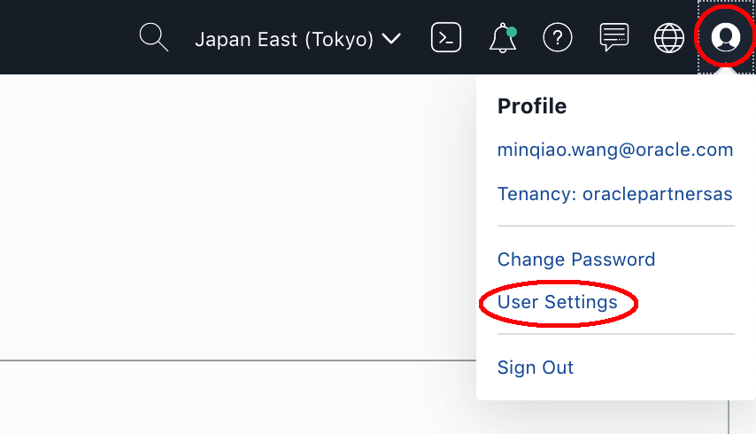

8. Under the **Resources**, choose **API Keys**, and click **Add Public Key**.

   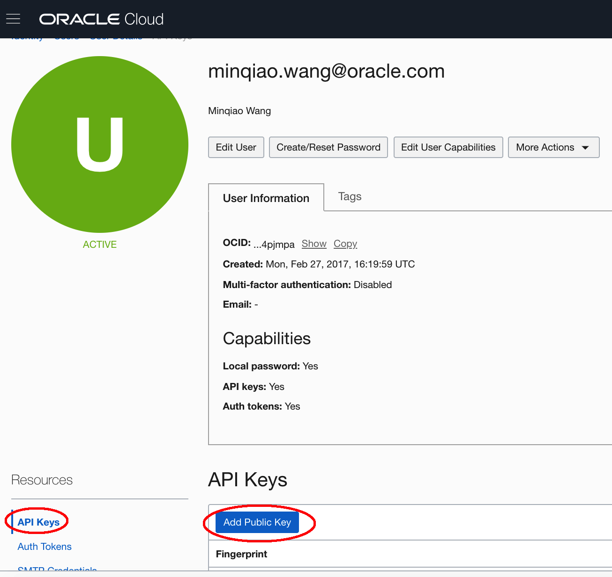

9. Choose **Paste Public Keys**, and paste the content of the public key, click **Add**.

   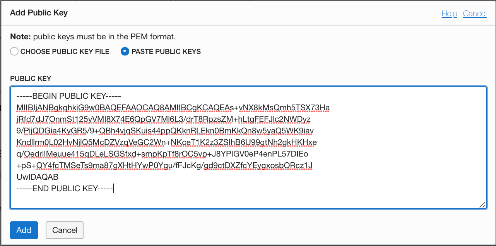

10. Back to the Termial and test OCI CLI.

    ```
    [opc@oke-bastion .oci]$ oci os ns get
    {
      "data": "oraclepartnersas"
    }
    [opc@oke-bastion .oci]$ 
    ```


### Step3. Install kubectl binary with curl 

1. Download the latest release with the command:

   ```
   [opc@oke-bastion ~]$ curl -LO https://storage.googleapis.com/kubernetes-release/release/`curl -s https://storage.googleapis.com/kubernetes-release/release/stable.txt`/bin/linux/amd64/kubectl
     % Total    % Received % Xferd  Average Speed   Time    Time     Time  Current
                                    Dload  Upload   Total   Spent    Left  Speed
   100 41.4M  100 41.4M    0     0  46.3M      0 --:--:-- --:--:-- --:--:-- 46.2M
   [opc@oke-bastion ~]$ 
   ```

2. Make the kubectl binary executable.

   ```
   $ chmod +x ./kubectl
   ```

3. Move the binary in to your PATH.

   ```
   $ sudo mv ./kubectl /usr/local/bin/kubectl
   ```

4. Test to ensure the version you installed is up-to-date:

   ```
   [opc@oke-bastion ~]$ kubectl version --client
   Client Version: version.Info{Major:"1", Minor:"17", GitVersion:"v1.17.4", GitCommit:"8d8aa39598534325ad77120c120a22b3a990b5ea", GitTreeState:"clean", BuildDate:"2020-03-12T21:03:42Z", GoVersion:"go1.13.8", Compiler:"gc", Platform:"linux/amd64"}
   [opc@oke-bastion ~]$
   ```

5. In the kubernetes cluster page, click **Access Cluster**.

   

   

6. From the Pop up window, copy and run each of the command in the bastion host.

   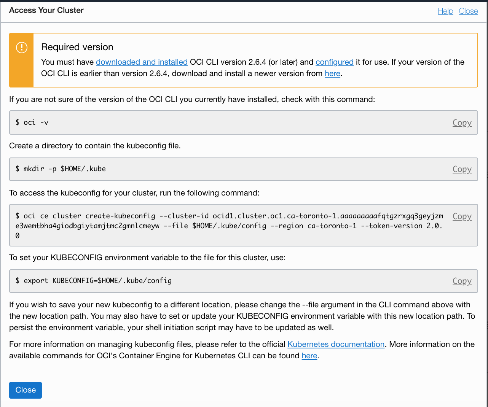

7. In the bastion host, run these commands like the following:

   ```
   [opc@oke-bastion ~]$ mkdir -p $HOME/.kube
   [opc@oke-bastion ~]$ oci ce cluster create-kubeconfig --cluster-id ocid1.cluster.oc1.ca-toronto-1.aaaaaaaaafqtgzrxgq3geyjzme3wemtbha4giodbgiytamjtmc2gmnlcmeyw --file $HOME/.kube/config --region ca-toronto-1 --token-version 2.0.0 
   New config written to the Kubeconfig file /home/opc/.kube/config
   [opc@oke-bastion ~]$ export KUBECONFIG=$HOME/.kube/config
   [opc@oke-bastion ~]$
   ```

   

9. Now you can access the kubernetes cluster.

   ```
   [opc@oke-bastion ~]$ kubectl get nodes
   NAME        STATUS   ROLES   AGE   VERSION
   10.0.10.2   Ready    node    9h    v1.15.7
   10.0.10.3   Ready    node    9h    v1.15.7
   10.0.10.4   Ready    node    9h    v1.15.7
   [opc@oke-bastion ~]$ 
   ```

   

   