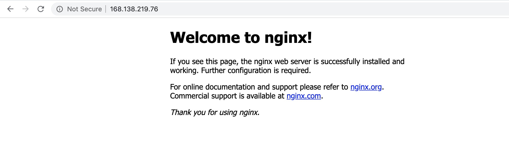
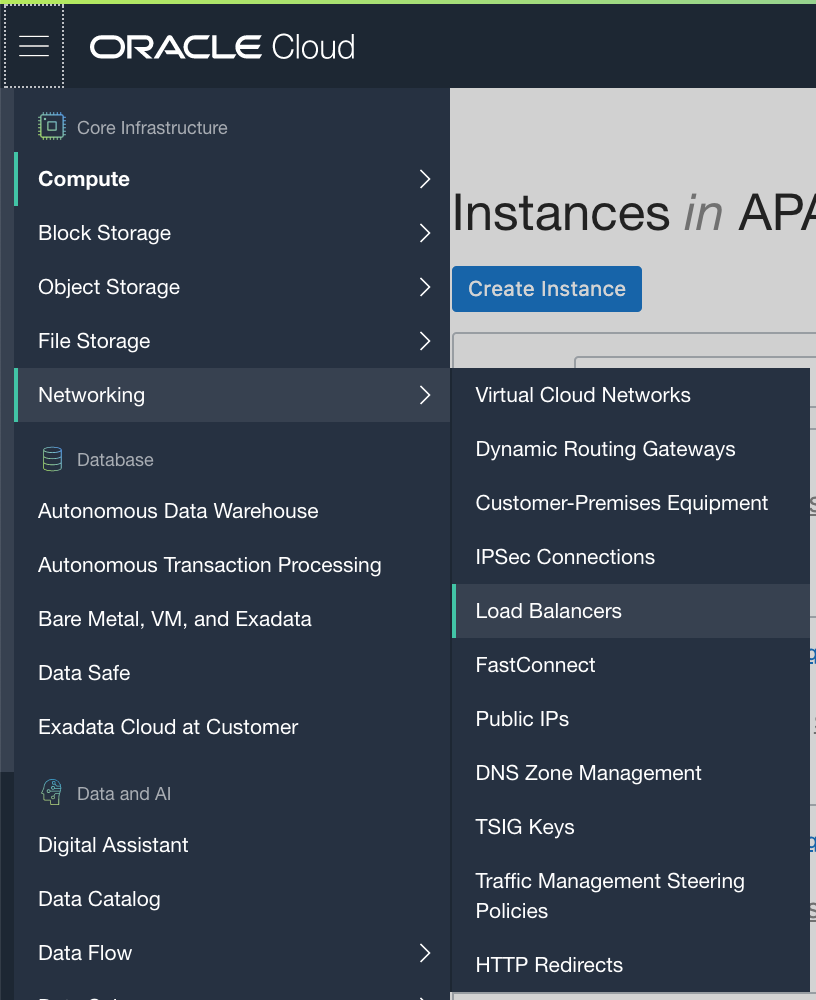
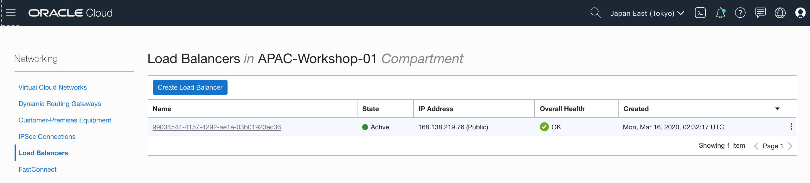
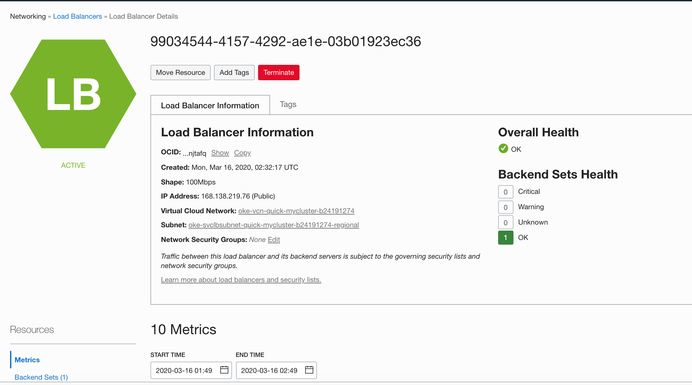

# Deploy a Sample Ngnix App

Having created a Kubernetes cluster using Container Engine for Kubernetes, you'll typically want to try it out by deploying an application on the nodes in the cluster. In the following steps, you will deploy a Nginx sample application on 3 pods, and create a load balancer to distribute service traffic among the nodes assigned to that service. 

1. From the bastion host, edit a file named `nginx_lb.yaml`.

   ```
   $ vi nginx_lb.yaml
   ```

2. Copy the following content into the file. It defines a deployment (`kind: Deployment`) for the `nginx` app, followed by a service definition with a type of LoadBalancer (`type: LoadBalancer`) that balances http traffic on port 80 for the `nginx` app. Save and exit the editor.

   ```
   apiVersion: apps/v1
   kind: Deployment
   metadata:
     name: my-nginx
     labels:
       app: nginx
   spec:
     replicas: 3
     selector:
       matchLabels:
         app: nginx
     template:
       metadata:
         labels:
           app: nginx
       spec:
         containers:
         - name: nginx
           image: nginx:1.7.9
           ports:
           - containerPort: 80
   ---
   apiVersion: v1
   kind: Service
   metadata:
     name: my-nginx-svc
     labels:
       app: nginx
   spec:
     type: LoadBalancer
     ports:
     - port: 80
     selector:
       app: nginx
   ```

3. To create the deployment and service defined in `nginx_lb.yaml` while connected to your Kubernetes cluster, enter the command:

   ```
   [opc@oke-bastion ~]$ kubectl apply -f nginx_lb.yaml
   deployment.apps/my-nginx created
   service/my-nginx-svc created
   [opc@oke-bastion ~]$ 
   ```

4. The load balancer may take a few minutes to go from a pending state to being fully operational. You can view the current state of your cluster by entering `kubectl get all`, where your output looks similar to the following:

   ```
   [opc@oke-bastion ~]$ kubectl get all
   NAME                            READY   STATUS    RESTARTS   AGE
   pod/my-nginx-5754944d6c-pv88n   1/1     Running   0          95s
   pod/my-nginx-5754944d6c-s9tds   1/1     Running   0          95s
   pod/my-nginx-5754944d6c-vndp9   1/1     Running   0          95s
   
   NAME                   TYPE           CLUSTER-IP      EXTERNAL-IP      PORT(S)        AGE
   service/kubernetes     ClusterIP      10.96.0.1       <none>           443/TCP        23h
   service/my-nginx-svc   LoadBalancer   10.96.191.201   168.138.219.76   80:30221/TCP   95s
   
   NAME                       READY   UP-TO-DATE   AVAILABLE   AGE
   deployment.apps/my-nginx   3/3     3            3           95s
   
   NAME                                  DESIRED   CURRENT   READY   AGE
   replicaset.apps/my-nginx-5754944d6c   3         3         3       95s
   [opc@oke-bastion ~]$ 
   ```

5. The output shows that the `my-nginx` deployment is running on 3 pods (the po/my-nginx entries), that the load balancer is running (svc/my-nginx-svc) and has an external IP (168.138.219.76) that clients can use to connect to the app that's deployed on the pods.

6. Now open a new browser page, enter the url `http://168.138.219.76`, you can see the Ngnix app is sucessfully working.

   

7. In the OCI console, open the navigation menu, select **Networking**, then select **Load Balancers**.

   

8. In the Load Balancers page, you can found a load balancer created by kubectl. 

   

9. Click the load balancer name link, and go to the details page. The load balancer is deploy in the public subnet.

   

10. you can use the following command to delete the Ngnix appliation and Load Balancer service.

    ```
    [opc@oke-bastion ~]$ kubectl delete -f nginx_lb.yaml 
    deployment.apps "my-nginx" deleted
    service "my-nginx-svc" deleted
    [opc@oke-bastion ~]$
    ```

    

