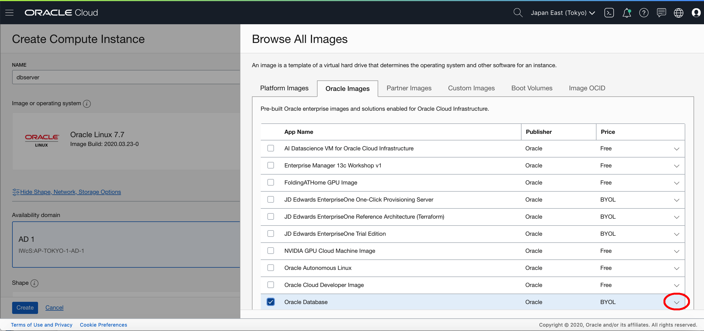
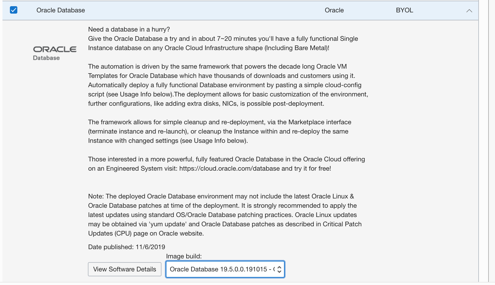
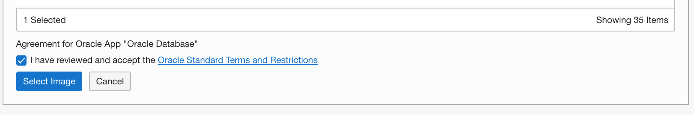
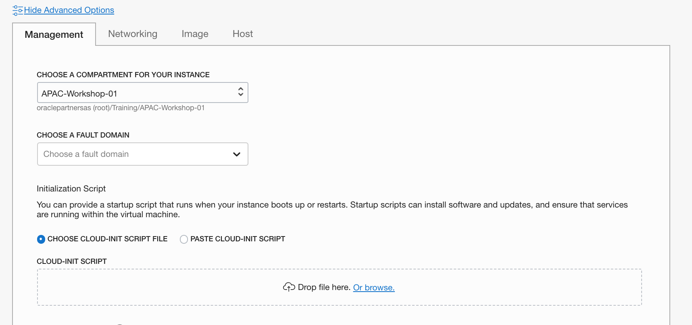
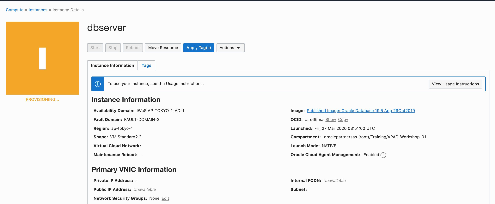

# Create a Database using the Custom image

##Prepare the Network

1. In the VCN of the kubernetes cluser, create a new security list name my-private-seclist

   - ingress rule:
     - 10.0.0.0/16 TCP ALL 22
     - 10.0.0.0/16 TCP ALL 1521
   - egress rule:
     - 0.0.0.0/0 All Protocals

2. Create a new route table: my-route-table, using the exist NAT gateway as the target

   - 0.0.0.0/0 	NAT Gateway	oke-ngw-quick-...

3. Create a new private subnet named my-private-subnet.

   - CIDR Block: 10.0.50.0/24
   - Secrity List: my-private-seclist
   - Route Table: my-rout-table

   

## Download Marketplace Initialization Zip

1. Click [**here**](https://community.oracle.com/servlet/JiveServlet/download/1031489-6-462822/oci-db-app-script-examples.zip) to download the marketplace initialization zip file.
2. Save it to your downloads folder
3. Unzip the folder and locate the `StandardIO-db.cloud-init` file. You will need this later when you create your compute instance.


## Create Compute Instance

1. From OCI console, create a Compute Instance named **dbserver**.

2. Click Change Image, and select Oracle Images. Click the down arrow to select the database version.

3. Select the 19c version from the image build.

4. Scroll down, accept the standards and conditions and click the **Select Image** button.

5. Change VM Shape to VM.Standard2.2

6. Choose the VCN and the subnet(*my-private-subnet*) you created before.

7. Add SSH Public Key, so the Database Host can by access by bastion host.

8. Click on **Show Advanced Options**. Choose the correct compartment. Click on the **Choose Cloud-Init Script File**. Click **browse**.

9. Select the extracted `StandardIO-cloud-init` script. There are multiple scripts dependent on the shape you want. For this lab, we will be using the Standard IO.

   

10. Click the **Create** button to create your instance. Your instance will be in the provisioning state for about 5 minutes. Verify that you chose the correct image. In a few minutes you can also verify that you have a public IP address. View the Work Requests at the bottom, this will show where your instance is.

11. Once the instance moves to the `Running` state, You can ssh access the dbserver from your bastion server.

12. Using this command to monitoring the deployment progress:

    ```
    tail -f /u01/ocidb/buildsingle.log
    ```

     

13. You need wait more time about 15 minutes until the database setup is ready. You can write down the information of your dbserver. For example:

    - Private IP address: 10.0.50.3
    - Host Name: dbserver.myprivatesubnet.mycluster.oraclevcn.com

    The default Database inforamation is:

    - SID: ORCL
    - CDB Servicename: ORCL
    - PDB Servicename: orclpdb
    - password: Ora_DB4U

    You can check  the database status from the bastion host using the following command:

    ```
    [opc@oke-bastion oracle-db-operator]$ ssh -i ../labkey opc@10.0.50.3
    Last login: Fri Mar 27 03:56:37 2020 from oke-bastion.lbsubf4fedd375.mycluster.oraclevcn.com
    [opc@dbserver ~]$ sudo su - oracle
    Last login: Fri Mar 27 04:28:56 GMT 2020
    [oracle@dbserver ~]$ . oraenv
    ORACLE_SID = [oracle] ? ORCL
    The Oracle base remains unchanged with value /u01/app/oracle
    [oracle@dbserver ~]$ lsnrctl status
    
    LSNRCTL for Linux: Version 19.0.0.0.0 - Production on 27-MAR-2020 04:54:23
    
    Copyright (c) 1991, 2019, Oracle.  All rights reserved.
    
    Connecting to (DESCRIPTION=(ADDRESS=(PROTOCOL=TCP)(HOST=dbserver.myprivatesubnet.mycluster.oraclevcn.com)(PORT=1521)))
    STATUS of the LISTENER
    ------------------------
    Alias                     LISTENER
    Version                   TNSLSNR for Linux: Version 19.0.0.0.0 - Production
    Start Date                27-MAR-2020 04:00:01
    Uptime                    0 days 0 hr. 54 min. 22 sec
    Trace Level               off
    Security                  ON: Local OS Authentication
    SNMP                      OFF
    Listener Parameter File   /u01/app/oracle/product/19c/dbhome_1/network/admin/listener.ora
    Listener Log File         /u01/app/oracle/diag/tnslsnr/dbserver/listener/alert/log.xml
    Listening Endpoints Summary...
      (DESCRIPTION=(ADDRESS=(PROTOCOL=tcp)(HOST=dbserver)(PORT=1521)))
      (DESCRIPTION=(ADDRESS=(PROTOCOL=ipc)(KEY=EXTPROC1521)))
    Services Summary...
    Service "ORCL" has 1 instance(s).
      Instance "ORCL", status READY, has 1 handler(s) for this service...
    Service "ORCLXDB" has 1 instance(s).
      Instance "ORCL", status READY, has 1 handler(s) for this service...
    Service "a1cf890a72932b23e0530332000a2402" has 1 instance(s).
      Instance "ORCL", status READY, has 1 handler(s) for this service...
    Service "orclpdb" has 1 instance(s).
      Instance "ORCL", status READY, has 1 handler(s) for this service...
    The command completed successfully
    
    [oracle@dbserver ~]$ sqlplus system/Ora_DB4U@orclpdb
    
    SQL*Plus: Release 19.0.0.0.0 - Production on Fri Mar 27 04:55:03 2020
    Version 19.5.0.0.0
    
    Copyright (c) 1982, 2019, Oracle.  All rights reserved.
    
    Last Successful login time: Fri Mar 27 2020 04:54:29 +00:00
    
    Connected to:
    Oracle Database 19c Enterprise Edition Release 19.0.0.0.0 - Production
    Version 19.5.0.0.0
    
    SQL> 
    ```

    

