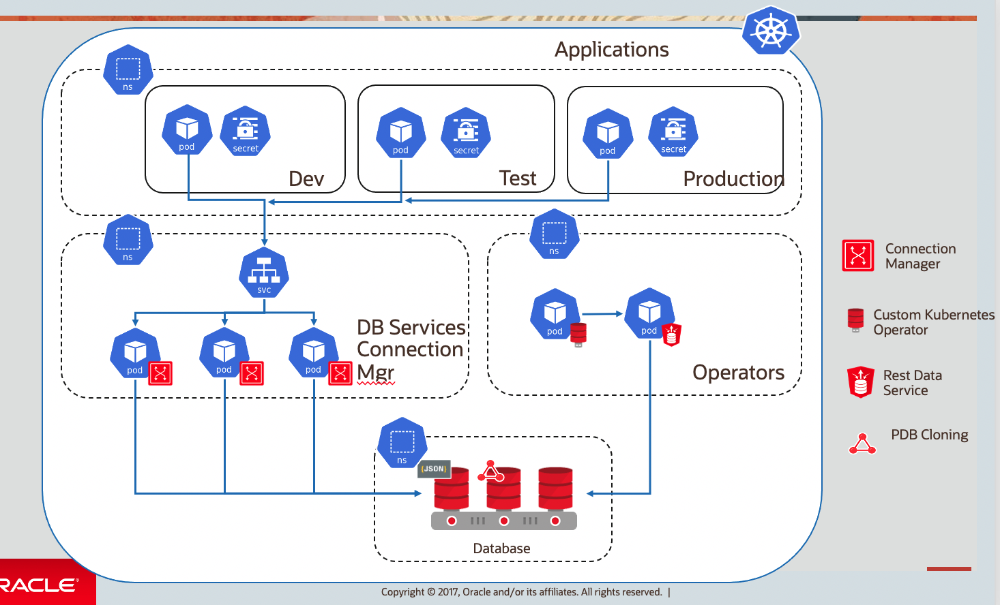

# Kubernetes in OCI #

### 简介

Oracle OCI容器引擎 （Container Engine for Kubernetes）是一项完全托管、可扩展且高度可用的服务，可用于将容器化应用程序部署到云。 当您的开发团队想要可靠地构建、部署和管理云原生应用程序时，可以使用 OCI Kubernetes 容器引擎（OKE）。 您指定应用程序所需的计算资源以及Kubernetes 容器引擎部署在现有 OCI 租户中的 Oracle OCI上。

本实验你将练习如何在OCI的Kubernetes集群（OKE）上部署应用，并与Oracle数据库集成。

实验中你可以利用Oracle数据库的REST接口部署新的多租户数据库PDB或者克隆一个已存在的pdb。支持各种方式部署的Oracle数据库，包括本地部署，数据库云服务，或者数据库容器部署。（本实验采用docker container中的数据库image）。

通过Oracle Connection Manager将复杂的数据库连接管理抽象出来，以便拥有“标准”的 kubernetes 开发人员拥有“标准”的体验。

Operator创建一个包含所有连接信息的secret，其可见性可以限制为应用程序本身，以实现credentials的隔离。

完整的架构图如下：

### 实验先决条件

- 一个有效的OCI帐号
- 租户，用户，区间（compartment）的OCIDs 

## 备注

- **作者** - 王敏桥, 甲骨文中国 - 2021年7月

