# 创建Kubernetes集群 

### 简介

通过本练习，你将学习到如何在OCI上创建 Kubernetes集群。

## 先决条件

- 你需要OCI租户账号，并且Container Engine for Kubernetes可用.
- 你的租户必须有足够的不同资源的配额，如：计算资源，块存储资源，Load Balancer资源，等等。
- 要创建或管理k8s集群，你必须属于具有合适的OKE权限的组
- 在 root compartment中设置策略（ policy）：  ```allow service OKE to manage all-resources in tenancy```.
- 一组SSH键用来访问集群中的工作节点和堡垒机

##利用缺省设置快速创建Kubernetes集群

1. 登录到**OCI控制台**，打开**导航菜单**，选择**开发人员服务**，在**容器和构件**下点击**Kubernetes集群（OKE）**。

   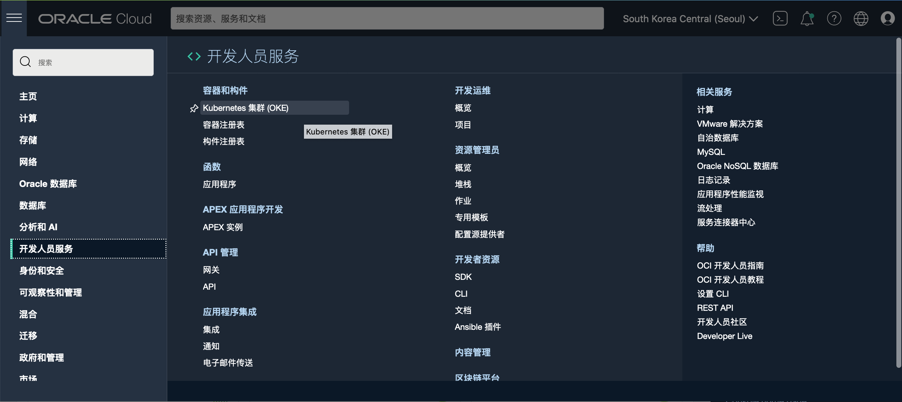

2. 选择合适的**区域（Region）**和**区间（Compartment）**，点击**创建集群**。

   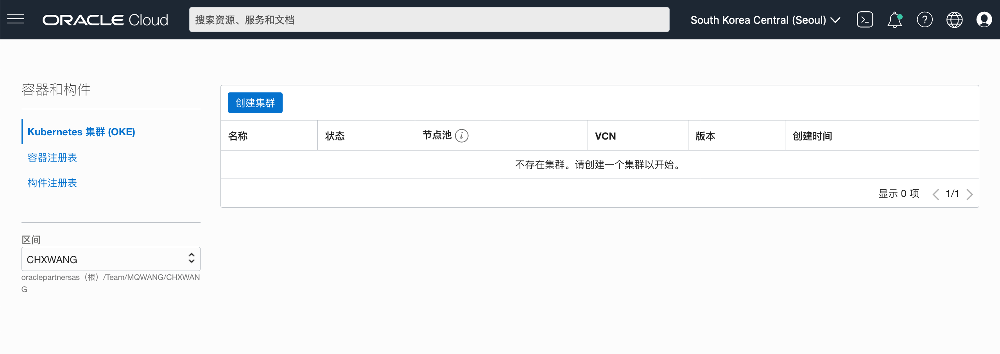

3. 在**创建集群**对话框里，选择**快速创建**，点击**启动工作流**。

   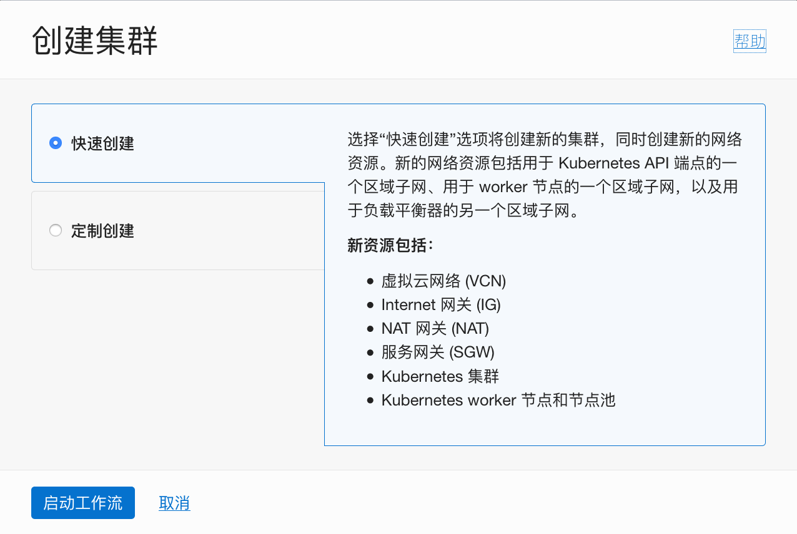

4. 在**创建集群**页面，按以下内容选择或输入：

   - **名称:** 任意合法的名称，如：mycluster
   - **区间:** 选择你将要部署Kubernetes集群的区间。
   - **Kubernetes 版本:** 接受缺省值（最新版本）
   - **Kubernetes API端点:** 接受缺省选项，公共端点。
   - **Kubernetes Worker节点:** 接受缺省选项，专用Worker。

   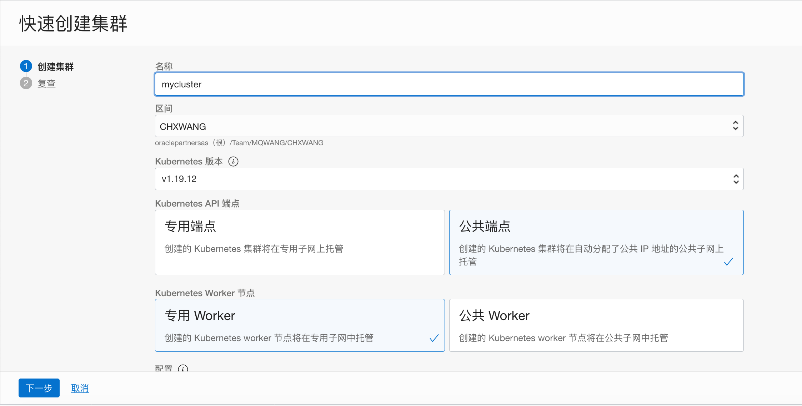

   - **配置:** 接受缺省配置，VM.Standard.E3.Flex, 1 OCPU, 16G内存

   - **节点数量:** 接受缺省值: 3

       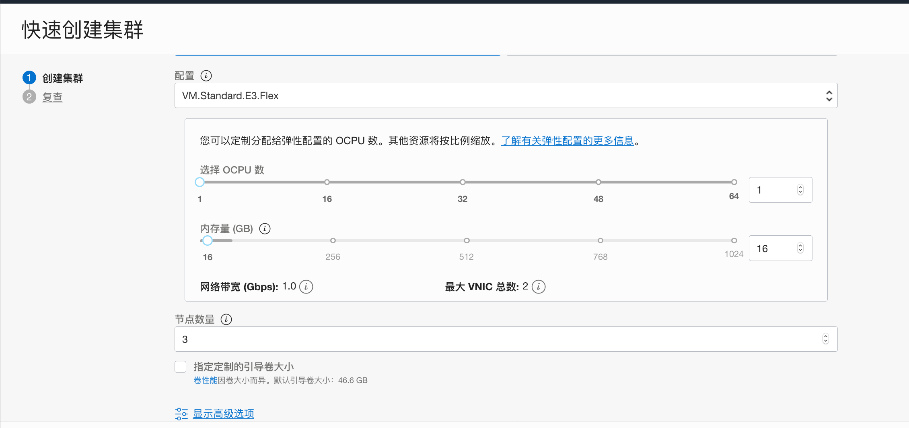

       

5. 点击**选择高级选项**。

   - **映像验证：**接受缺省非勾选状态。如果勾选，则只允许在OCI容器注册表里经过签名的image部署到集群中。
   - **添加SSH密钥：**此为可选项。在本实验中我们可以上传事先准备好的SSH公共密钥，以便以后可以通过密钥来访问Worker节点。

   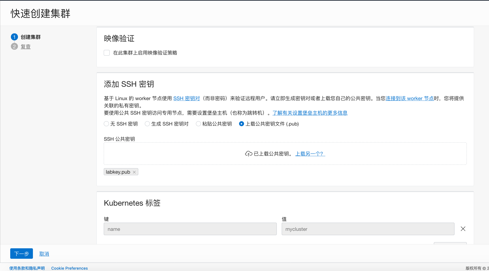

   

   

6. 点击**下一步**复查要创建的集群的详细信息。

   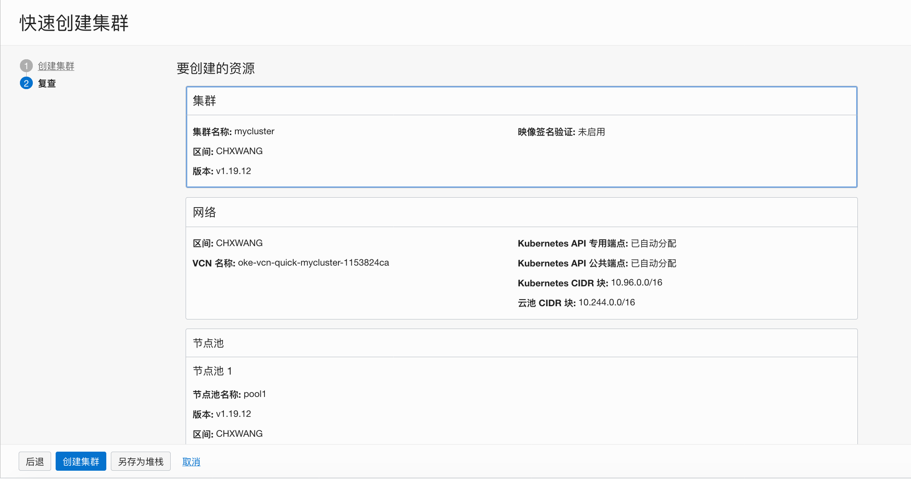

7. 点击**创建集群**，开始创建新的网络资源和新的集群。

   

8. 点击**关闭**，来到集群详细信息页面。 可以看到当前集群正在创建中。

   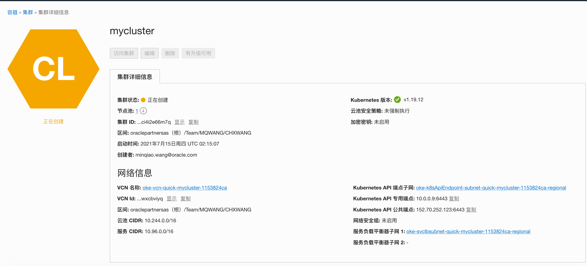

9. 等待10分钟左右，集群状态变成活动状态。

   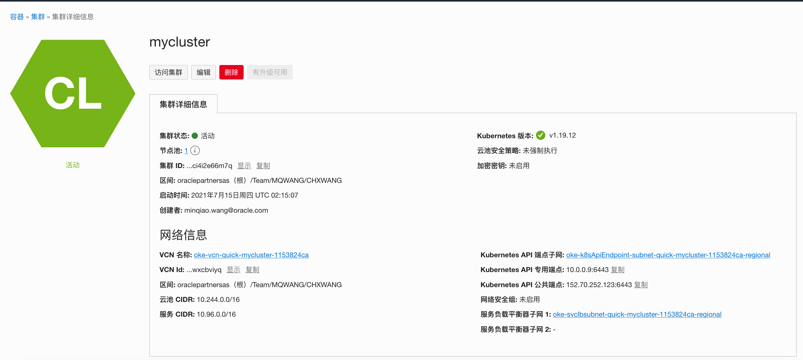

10. 在**资源**下选择**节点池**，可以看到已经有一个节点池创建，名字为：pool1.

   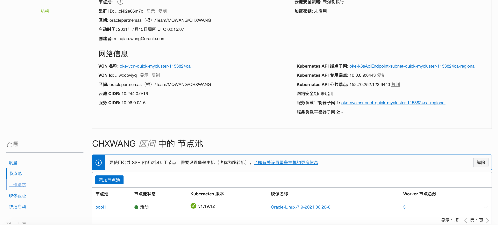

11. 点击pool1，进入节点池详细信息页面。

    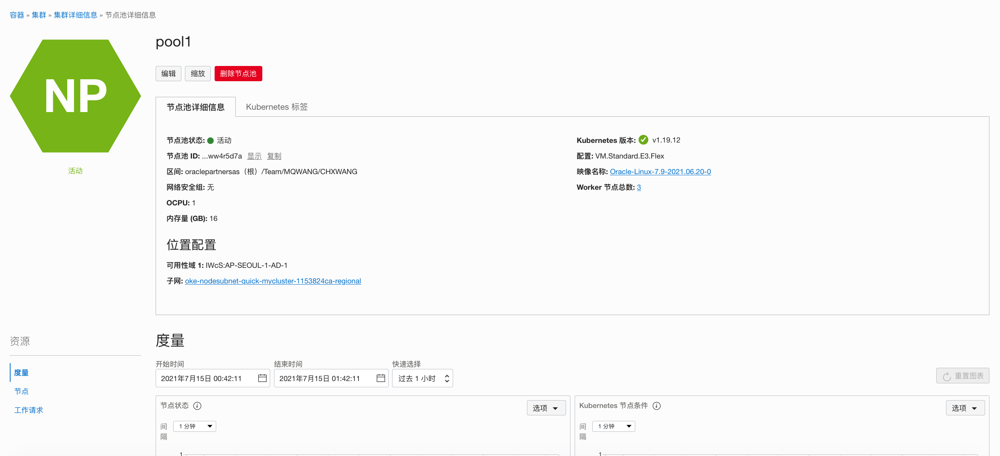

12. 在**资源**下选择**节点**，可以看到当前有3个节点还在**未就绪**状态。

    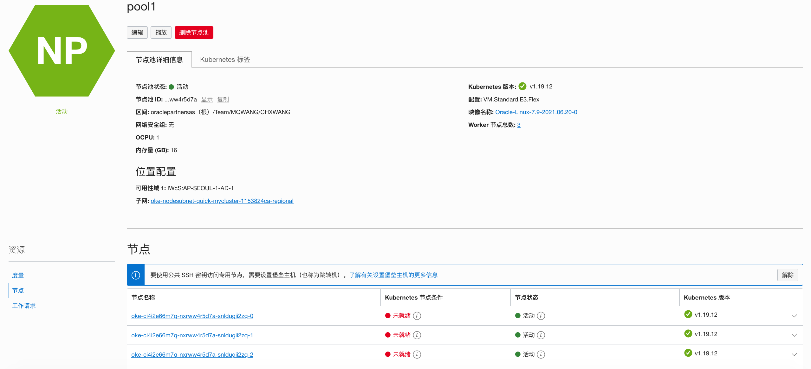

13. 几分钟后，3个节点都变成**就绪**状态，集群创建成功。

    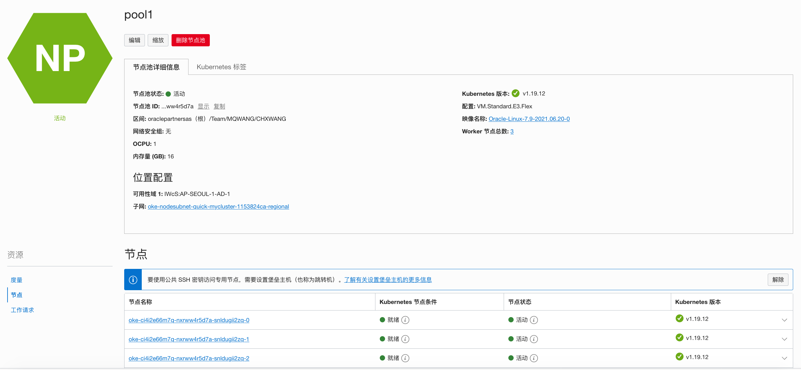

14. 打开**导航菜单**，选择**网络**，点击**虚拟云网络**。

    

15. 可以看到新创建的VCN，名称为：`oke-vcn-mycluster-***`。

    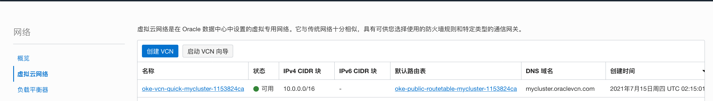

16.  在虚拟网络详细信息页面，可以看到三个子网，分别对应Load Balancer，Worker节点，以及Kubernetes API Endpoint。

    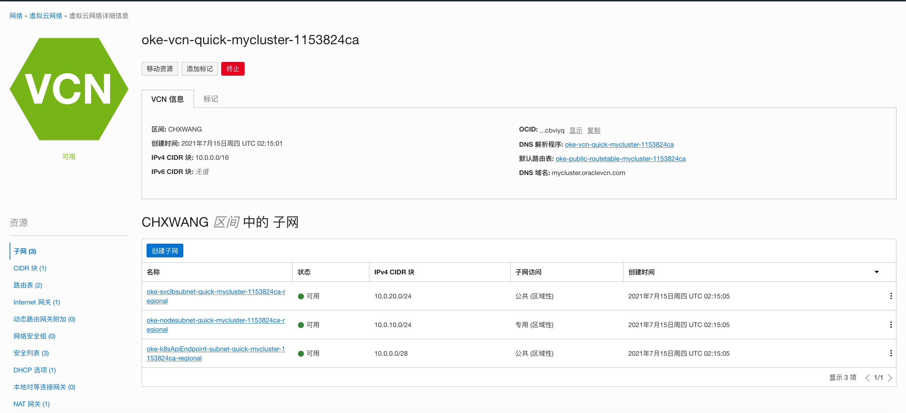

17. 打开**导航菜单**，选择**计算**，点击**实例**。

    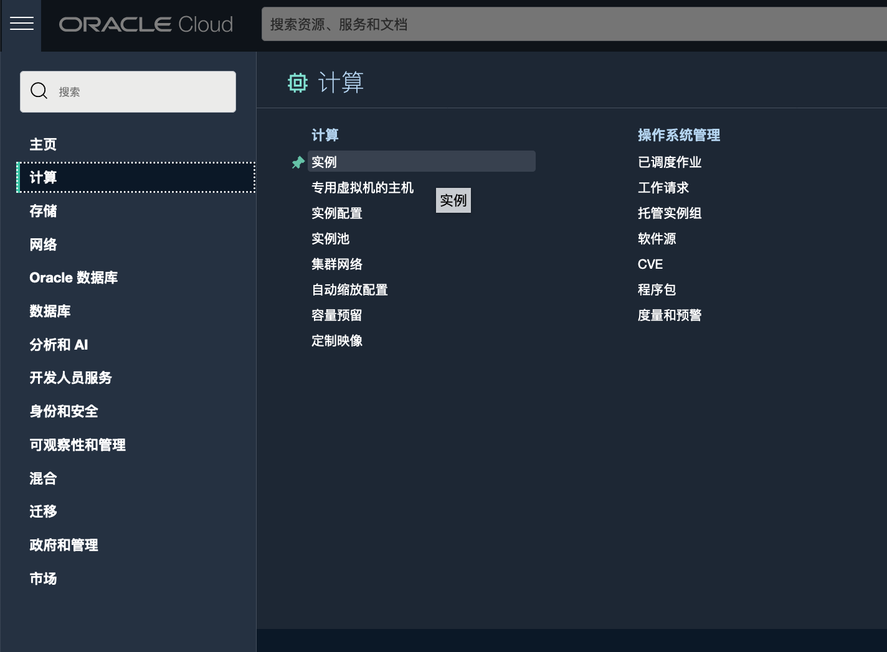

18. 可以看到新创建的3个节点实例。

    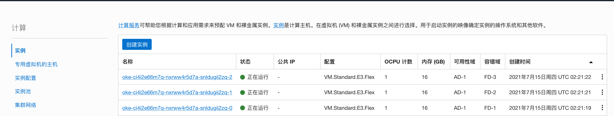

    

    现在你可以开始下一个实验。

    

    


